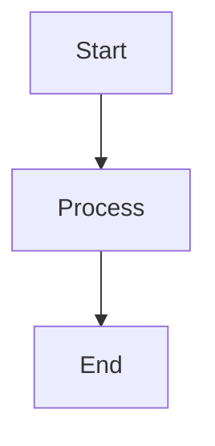
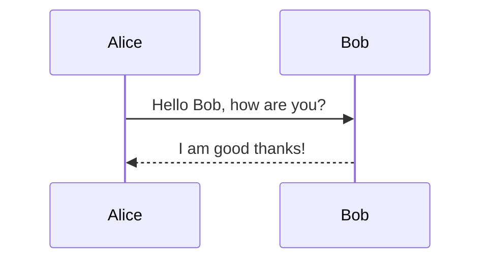

# SliCLI 🎯

**A powerful, zero-configuration CLI slide generator that transforms Markdown into beautiful presentations**

[](https://golang.org/)
[](LICENSE)
[](https://github.com/fredcamaral/slicli)

## 🚀 Quick Start

```bash
# Install slicli
go install github.com/fredcamaral/slicli/cmd/slicli@latest

# Create your first presentation
echo "# Hello World\n\nWelcome to SliCLI!" > presentation.md

# Serve and view
slicli serve presentation.md
```

Your presentation is now live at `http://localhost:1000` 🎉

## ✨ Features

### Core Capabilities
- **🚀 Zero Configuration** - Start presenting immediately, no build steps required
- **⚡ Live Reload** - Real-time preview with automatic file watching
- **🎨 10+ Professional Themes** - Executive Pro, Developer Dark, Academic Research, and more
- **🔌 Plugin System** - Extensible with Mermaid diagrams, syntax highlighting, and code execution
- **📱 Mobile Responsive** - Perfect rendering on all device sizes
- **🌐 Offline Ready** - No internet required for core functionality

### Advanced Features
- **📊 Mermaid Diagrams** - Integrated diagram generation
- **💻 Live Code Execution** - Run code snippets in presentations
- **🎯 Multiple Export Formats** - PDF, images, and web exports
- **🔧 Custom Themes** - CSS-based theming with template overrides
- **🏪 Community Marketplace** - Browse and install community plugins and themes

## 📦 Installation

### From Source
```bash
git clone https://github.com/fredcamaral/slicli.git
cd slicli
make build
sudo make install
```

### Using Go Install
```bash
go install github.com/fredcamaral/slicli/cmd/slicli@latest
```

## 🎨 Available Themes

SliCLI comes with 10+ professionally designed themes:

| Theme | Best For | Style |
|-------|----------|-------|
| **Executive Pro** | C-suite presentations | Corporate, professional |
| **Developer Dark** | Technical presentations | Dark mode, code-focused |
| **Academic Research** | Scholarly presentations | Clean, academic |
| **Startup Pitch** | Investor presentations | Modern, bold |
| **Modern Minimal** | Clean presentations | Minimalist, elegant |
| **Healthcare Pro** | Medical presentations | Professional, accessible |
| **Finance Pro** | Financial presentations | Data-focused, charts |
| **Education Plus** | Teaching materials | Friendly, educational |
| **Creative Studio** | Design presentations | Colorful, creative |
| **Scientific Pro** | Research presentations | Technical, structured |

```bash
# Use a specific theme
slicli serve --theme executive-pro presentation.md

# List all available themes
slicli themes list
```

## 🔌 Plugin System

### Built-in Plugins
- **Mermaid** - Generate diagrams from text
- **Syntax Highlight** - Beautiful code highlighting
- **Code Exec** - Live code execution

### Using Plugins in Markdown
````markdown


```go
package main

import "fmt"

func main() {
    fmt.Println("Hello, SliCLI!")
}
```
````

### Plugin Marketplace
```bash
# Browse available plugins
slicli marketplace list

# Search for plugins
slicli marketplace search diagram

# Install a plugin
slicli marketplace install plugin-name

# Get plugin information
slicli marketplace info plugin-name
```

## 📝 Creating Presentations

### Basic Markdown Structure
```markdown
---
title: "My Presentation"
author: "Your Name"
theme: "executive-pro"
---

# Welcome Slide

Your content here

---

# Second Slide

More content

- Bullet points
- Are supported
- Out of the box
```

### Advanced Features
```markdown
# Code Execution
```bash exec
echo "This code will run live!"
```

# Mermaid Diagrams


# Syntax Highlighting
```go
func main() {
    fmt.Println("Beautifully highlighted!")
}
```
```

## ⚙️ Configuration

### CLI Options
```bash
slicli serve [file] [flags]

Flags:
  --host string       Server host (default "localhost")
  --port int         Server port (default 1000)
  --theme string     Theme name (default "default")
  --config string    Config file path
  --no-browser      Don't auto-open browser
```

### Configuration File (slicli.toml)
```toml
[server]
host = "localhost"
port = 1000
auto_open = true

[theme]
name = "executive-pro"

[plugins]
enabled = true
whitelist = ["mermaid", "syntax-highlight"]

[metadata]
author = "Your Name"
company = "Your Company"
```

## 🏗️ Architecture

SliCLI follows **Clean Architecture** principles with a **Hexagonal (Ports & Adapters)** pattern:

```
├── cmd/                    # CLI entrypoints
├── internal/
│   ├── adapters/          # External interfaces
│   │   ├── primary/       # HTTP handlers, parsers
│   │   └── secondary/     # File system, plugins, themes
│   ├── domain/           # Business logic
│   │   ├── entities/     # Core models
│   │   ├── ports/        # Interface definitions
│   │   └── services/     # Business services
│   └── pkg/              # Shared utilities
├── plugins/              # Plugin implementations
├── themes/               # Theme definitions
└── examples/             # Sample presentations
```

## 🛠️ Development

### Prerequisites
- Go 1.24.4+
- Make

### Development Workflow
```bash
# Format code
make fmt

# Run tests
make test

# Security scan
make lint

# Build project
make build

# Run with example
make run
```

### Plugin Development
```bash
# Create a new plugin from template
cp -r examples/plugin-template plugins/my-plugin
cd plugins/my-plugin

# Implement your plugin logic in main.go
# Build the plugin
make build

# Test your plugin
make test
```

## 🤝 Contributing

We welcome contributions! SliCLI is fully open source and community-driven.

1. **Fork the repository**
2. **Create a feature branch** (`git checkout -b feature/amazing-feature`)
3. **Make your changes** following our coding standards
4. **Run quality checks** (`make fmt test lint`)
5. **Commit your changes** (`git commit -m 'feat: add amazing feature'`)
6. **Push to the branch** (`git push origin feature/amazing-feature`)
7. **Open a Pull Request**

### Coding Standards
- Follow Go best practices and conventions
- Maximum 50 lines per function
- Comprehensive error handling
- Security-first approach
- 100% test coverage for new features

## 📊 Performance

SliCLI is designed for speed and efficiency:

- **Fast Startup**: < 100ms initialization
- **Live Reload**: < 50ms file change detection
- **Memory Efficient**: < 50MB RAM usage
- **Plugin Loading**: < 10ms per plugin
- **Theme Switching**: Instant CSS swapping

## 🔒 Security

Security is a core principle:

- **Input Sanitization**: HTML sanitization with BlueMonday
- **Plugin Sandboxing**: Isolated plugin execution
- **Dependency Scanning**: Regular vulnerability checks
- **Static Analysis**: gosec security scanning
- **Safe Defaults**: Secure-by-default configuration

## 📚 Examples

Check out the `/examples` directory for:
- **Simple Presentation** - Basic markdown slides
- **Theme Showcase** - Demonstration of all themes
- **Plugin Usage** - Advanced plugin examples
- **Custom Theme** - Create your own theme
- **Plugin Template** - Plugin development starter

## 🗺️ Roadmap

### Current Focus (Open Source Community)
- ✅ Core slide generation and theming
- ✅ Plugin system with marketplace
- ✅ 10+ professional themes
- ✅ Live reload and development experience
- 🔄 Community plugin contributions
- 🔄 Enhanced export formats
- 🔄 Mobile presentation controls

### Future Enhancements
- Interactive slide elements
- Collaborative editing
- Advanced animation system
- Integration with popular tools
- Cloud synchronization (optional)

## 📄 License

This project is licensed under the **MIT License** - see the [LICENSE](LICENSE) file for details.

## 🙏 Acknowledgments

- **Go Community** - For the excellent tooling and ecosystem
- **Goldmark** - Powerful Markdown processing
- **Cobra** - CLI framework excellence
- **Contributors** - Everyone who helps make SliCLI better

---

**Built with ❤️ by the open source community**

[⭐ Star us on GitHub](https://github.com/fredcamaral/slicli) | [🐛 Report Issues](https://github.com/fredcamaral/slicli/issues) | [💬 Join Discussions](https://github.com/fredcamaral/slicli/discussions)