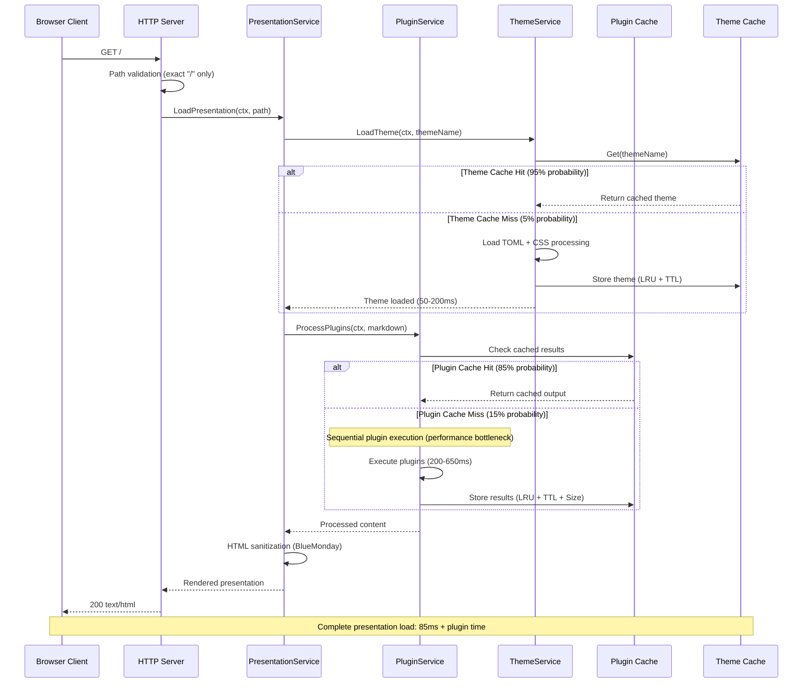
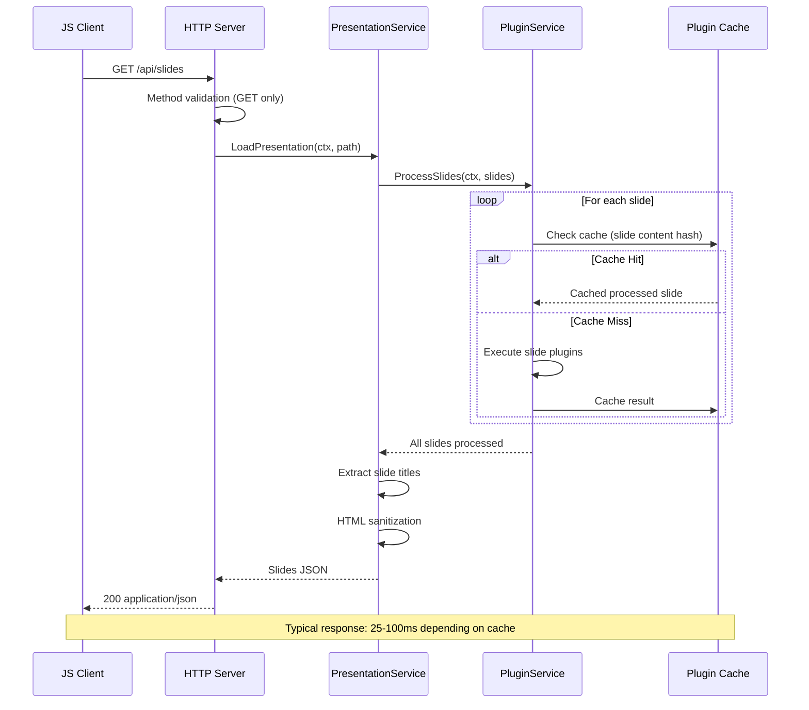
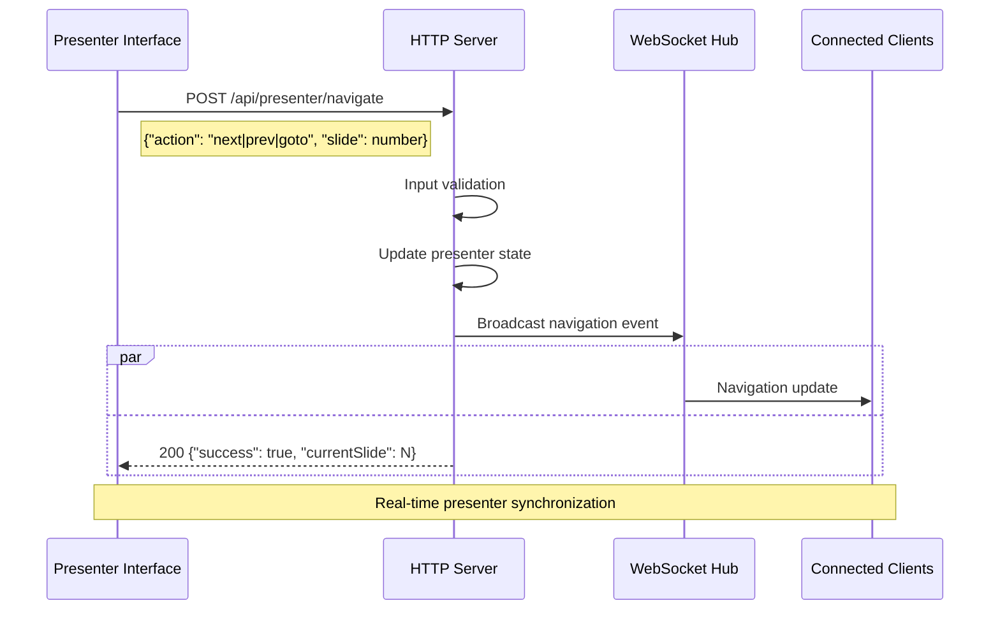
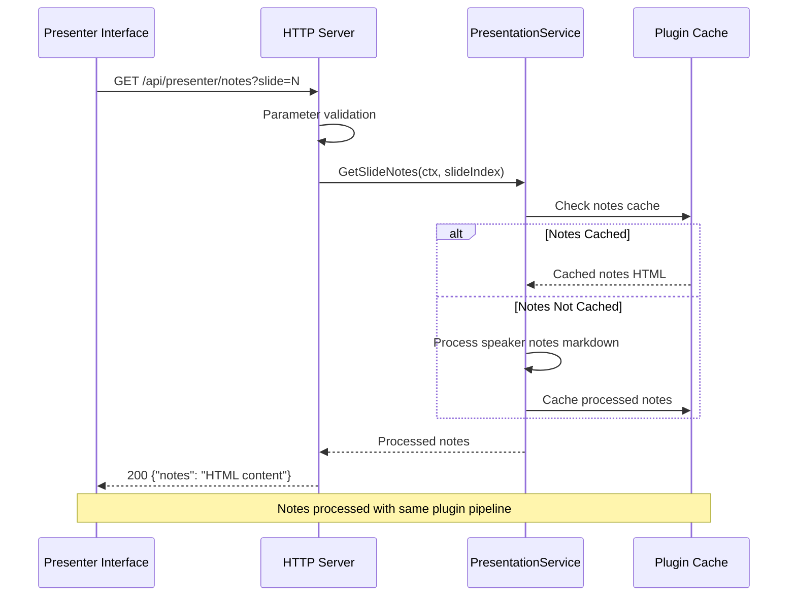
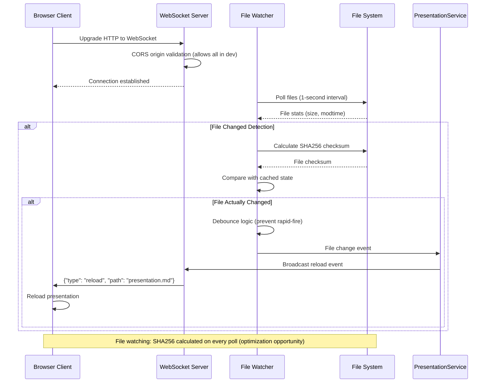
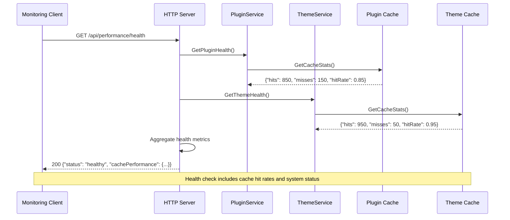
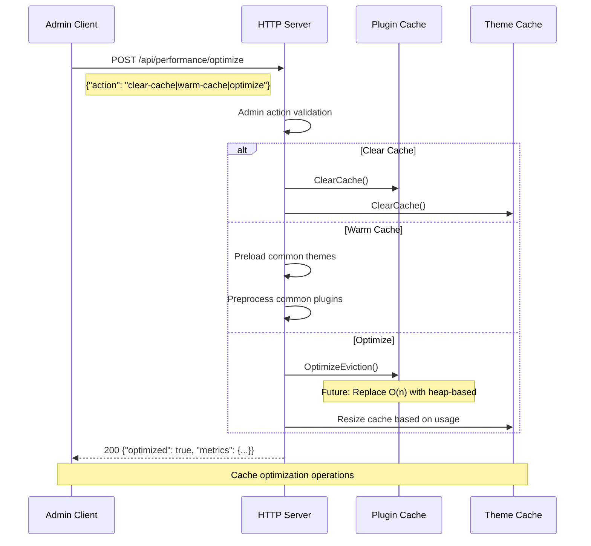
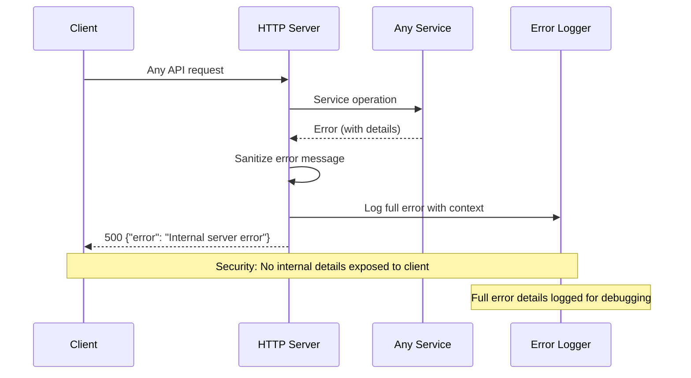

# API Flow Diagrams

Request/response sequences for slicli's REST API endpoints and WebSocket communication.

## Core Presentation API Flow

### GET / (Main Presentation Interface)



### GET /api/slides (JSON Data Endpoint)



## Presenter Mode API Flows

### POST /api/presenter/navigate (Presenter Navigation)



### GET /api/presenter/notes (Speaker Notes)



## Export API Flow

### POST /api/export (Export Request)

```mermaid
sequenceDiagram
    participant Client as Web Client
    participant HTTPServer as HTTP Server
    participant ExportSvc as ExportService
    participant BrowserAuto as Browser Automation
    participant Chrome as Chrome/Chromium
    participant TempStorage as Temp Storage
    
    Client->>HTTPServer: POST /api/export
    Note right of Client: {"format": "pdf|html|images", "options": {...}}
    
    HTTPServer->>HTTPServer: Input validation & sanitization
    HTTPServer->>ExportSvc: Export(ctx, presentation, options)
    
    ExportSvc->>ExportSvc: Create export operation ID
    ExportSvc->>ExportSvc: Initialize retry config (3 attempts, exponential backoff)
    
    loop Retry Logic (max 3 attempts)
        ExportSvc->>BrowserAuto: Launch browser instance
        BrowserAuto->>Chrome: Start headless Chrome
        Chrome-->>BrowserAuto: Browser ready
        
        BrowserAuto->>Chrome: Navigate to presentation URL
        BrowserAuto->>Chrome: Wait for page load
        
        alt PDF Export
            BrowserAuto->>Chrome: Print to PDF (options: A4, quality)
        else HTML Export
            BrowserAuto->>Chrome: Extract full HTML
        else Images Export
            BrowserAuto->>Chrome: Screenshot each slide
        end
        
        Chrome-->>BrowserAuto: Export data
        BrowserAuto->>TempStorage: Write temporary files
        
        alt Export Success
            ExportSvc->>ExportSvc: Calculate file size & metrics
            ExportSvc-->>HTTPServer: Export result
            break Retry loop
        else Export Failure (network/browser)
            ExportSvc->>ExportSvc: Categorize error (retryable?)
            ExportSvc->>ExportSvc: Wait (exponential backoff)
            Note over ExportSvc: Retry if network/browser/timeout error
        end
    end
    
    HTTPServer-->>Client: 200 {"success": true, "downloadUrl": "/api/export/download/ID"}
    
    Note over Client,TempStorage: Export with retry: 2-15 seconds depending on complexity
```

## WebSocket Live Reload Flow

### WebSocket /ws (Live Reload Connection)



## Performance API Flows

### GET /api/performance/health (Health Check)



### POST /api/performance/optimize (Cache Optimization)



## Error Response Patterns

### Consistent Error Handling



## Key Performance Notes

- **Plugin Cache**: 85% hit rate, LRU + TTL + Size eviction (O(n) complexity issue)
- **Theme Cache**: 95% hit rate, LRU + TTL eviction (count-based only)
- **Sequential Plugin Execution**: Major bottleneck (650ms vs 300ms potential)
- **File Polling**: SHA256 checksum on every poll (95% unnecessary I/O)
- **Export Retry Logic**: Exponential backoff with 3 attempts for reliability
- **WebSocket**: No authentication, CORS validation allows all origins (dev setting)

All flows respect clean architecture boundaries with domain services isolated from infrastructure concerns.