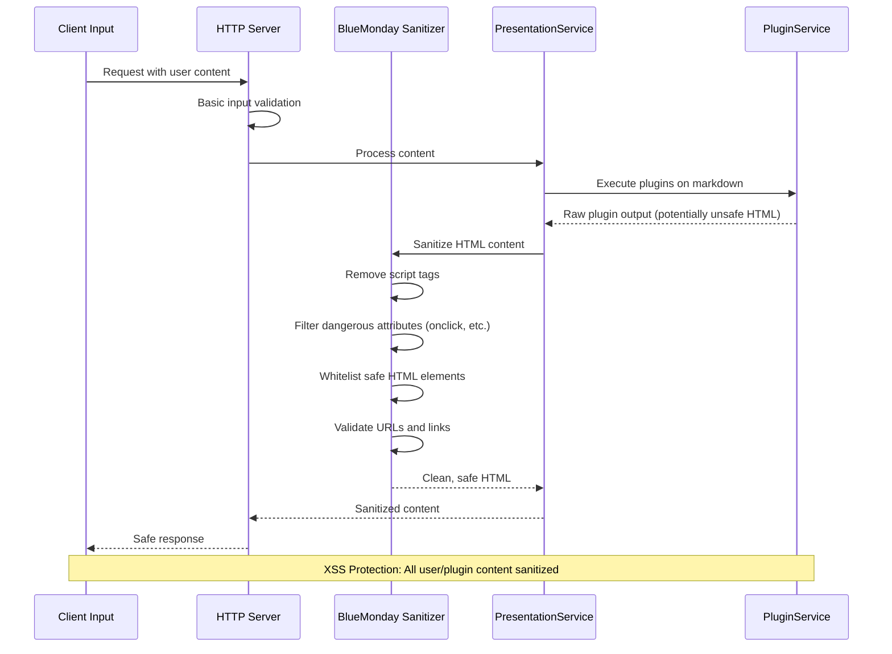
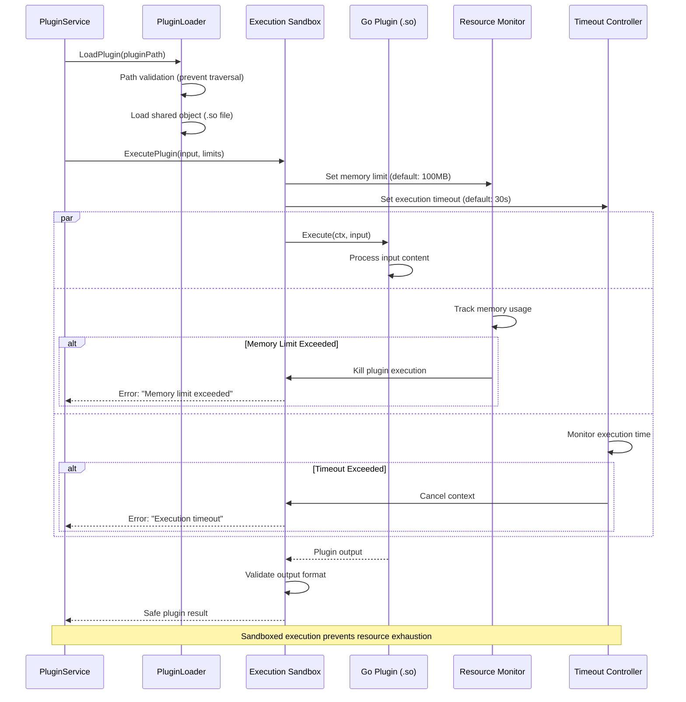
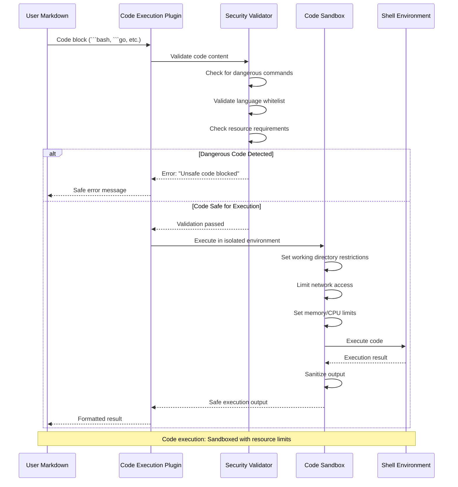
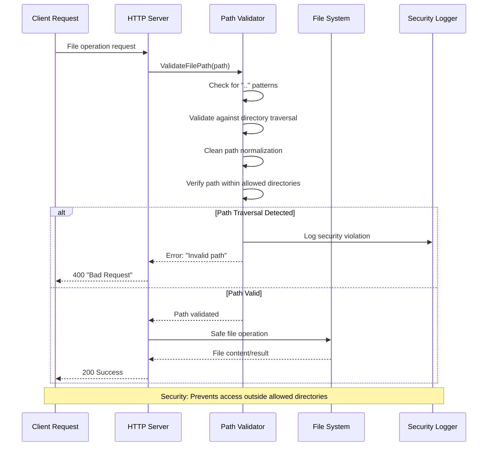
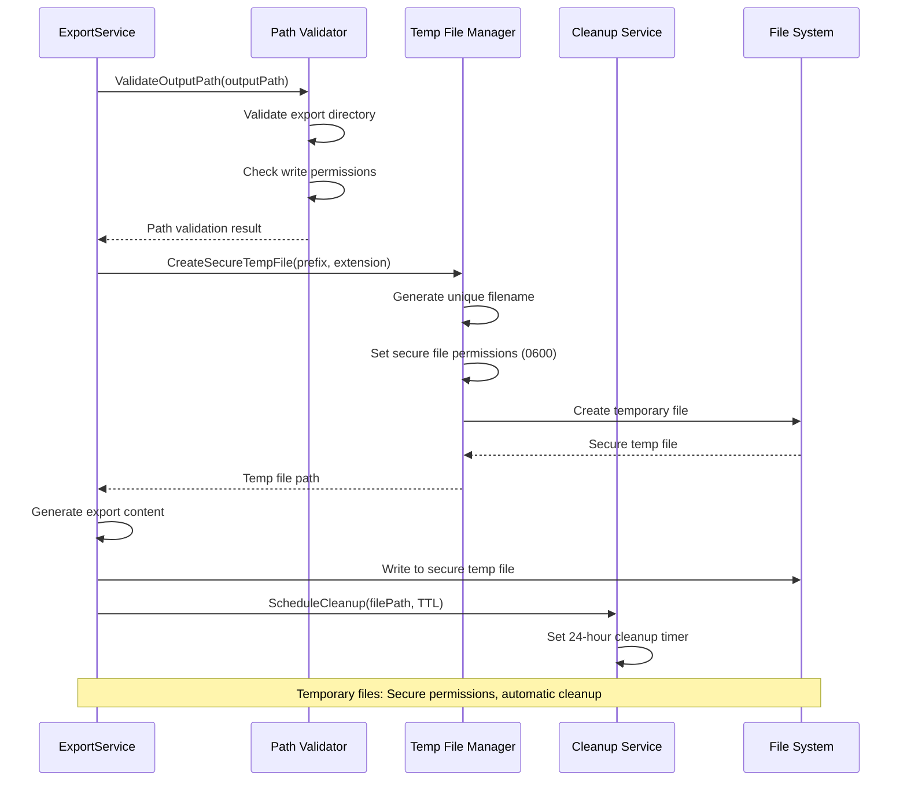
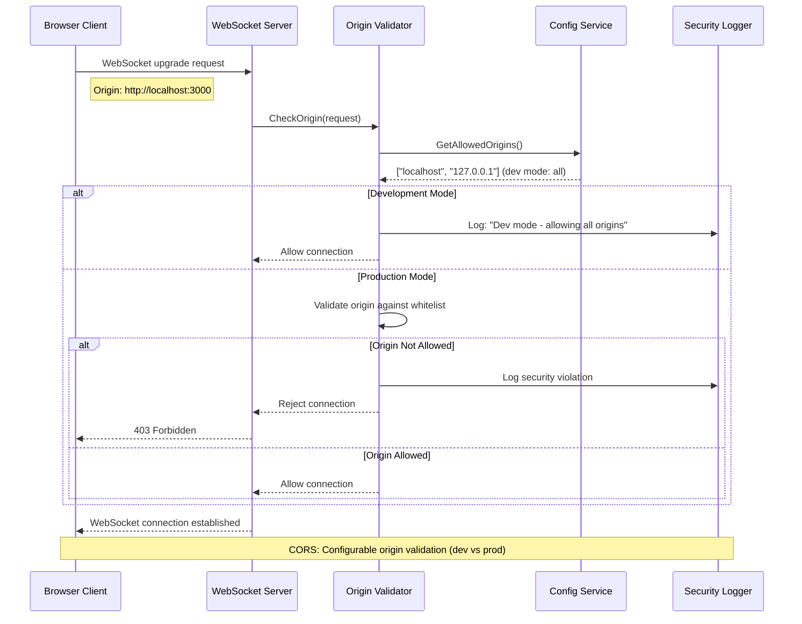
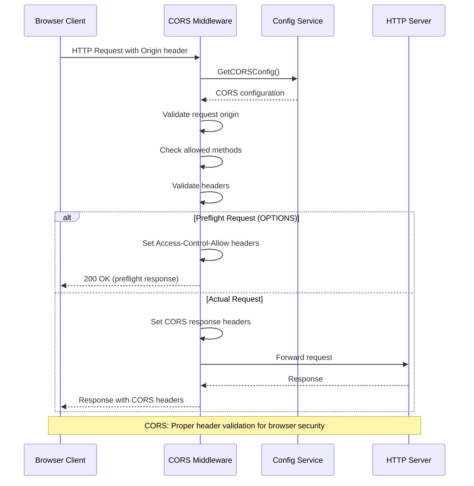
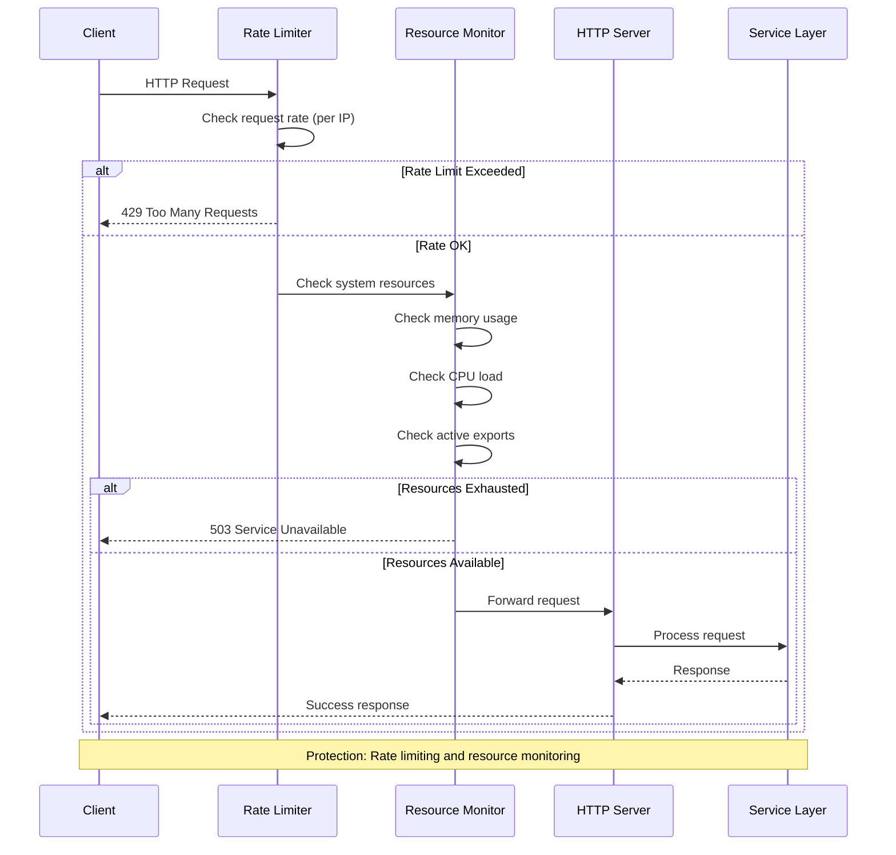

# Security Validation & Protection Flows

Security validation sequences for slicli (local CLI tool without traditional authentication).

## Input Sanitization Flow

### HTML Content Sanitization (BlueMonday)



## Plugin Sandboxing & Security

### Plugin Execution Sandboxing



### Code Execution Plugin Security



## File System Security

### Path Validation & Traversal Prevention



### Export File Security



## CORS & Origin Validation

### WebSocket Origin Validation



### HTTP CORS Header Validation



## Resource Protection

### Rate Limiting & Resource Protection



## Security Configuration

### Security Headers & Configuration

```mermaid
sequenceDiagram
    participant Client as Browser Client
    participant SecurityMiddleware as Security Middleware
    participant ConfigSvc as Config Service
    participant HTTPServer as HTTP Server
    
    Client->>SecurityMiddleware: HTTP Request
    SecurityMiddleware->>ConfigSvc: GetSecurityConfig()
    ConfigSvc-->>SecurityMiddleware: Security configuration
    
    SecurityMiddleware->>SecurityMiddleware: Add security headers
    Note over SecurityMiddleware: X-Content-Type-Options: nosniff
    Note over SecurityMiddleware: X-Frame-Options: DENY
    Note over SecurityMiddleware: X-XSS-Protection: 1; mode=block
    Note over SecurityMiddleware: Content-Security-Policy: default-src 'self'
    
    SecurityMiddleware->>HTTPServer: Request with security context
    HTTPServer-->>SecurityMiddleware: Response
    SecurityMiddleware->>SecurityMiddleware: Add response security headers
    SecurityMiddleware-->>Client: Secure response
    
    Note over Client,HTTPServer: Security: Comprehensive security headers
```

## Key Security Notes

**Input Validation**:
- All user input sanitized with BlueMonday HTML sanitizer
- Path validation prevents directory traversal attacks  
- Plugin code execution sandboxed with memory/time limits

**Resource Protection**:
- Plugin execution: 100MB memory limit, 30-second timeout
- File operations: Restricted to safe directories
- Export files: Secure temp directory with auto-cleanup

**Network Security**:
- CORS validation configurable (dev vs production)
- WebSocket origin checking (permissive in dev mode)
- Security headers added to all responses

**Process Isolation**:
- Go plugin system with sandboxed execution
- Browser automation in separate processes
- Resource monitoring and rate limiting

**File System Security**:
- Temporary files with secure permissions (0600)
- Automatic cleanup after 24 hours
- Path validation for all file operations

slicli prioritizes security for a local development tool while maintaining usability for presentation development workflows.