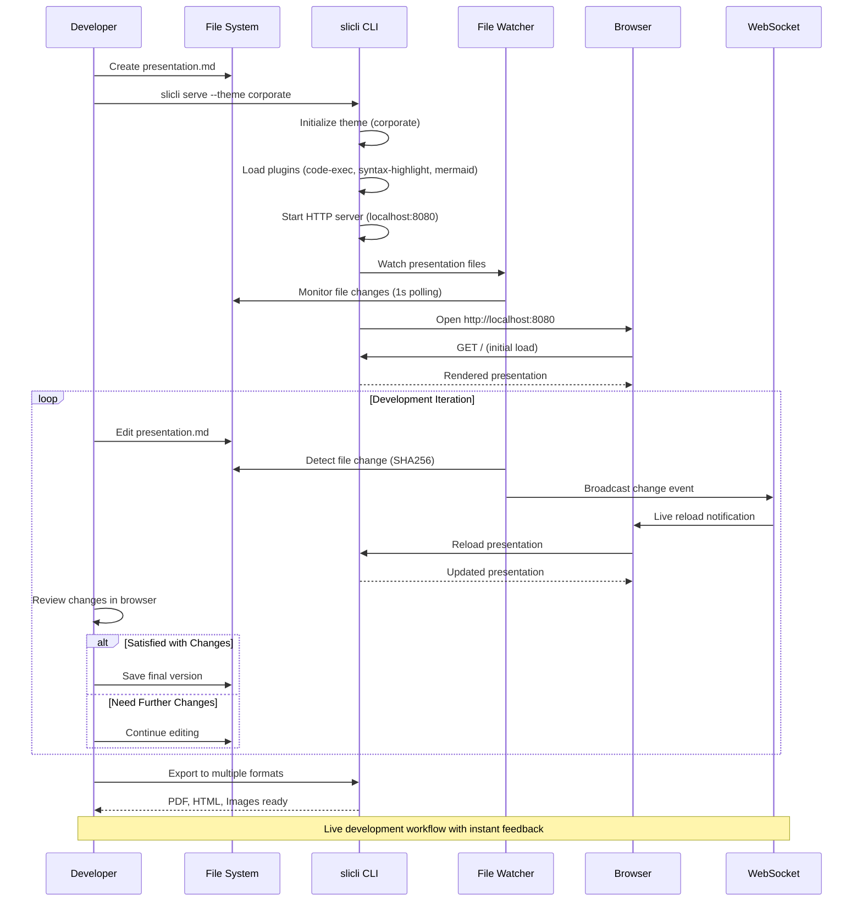
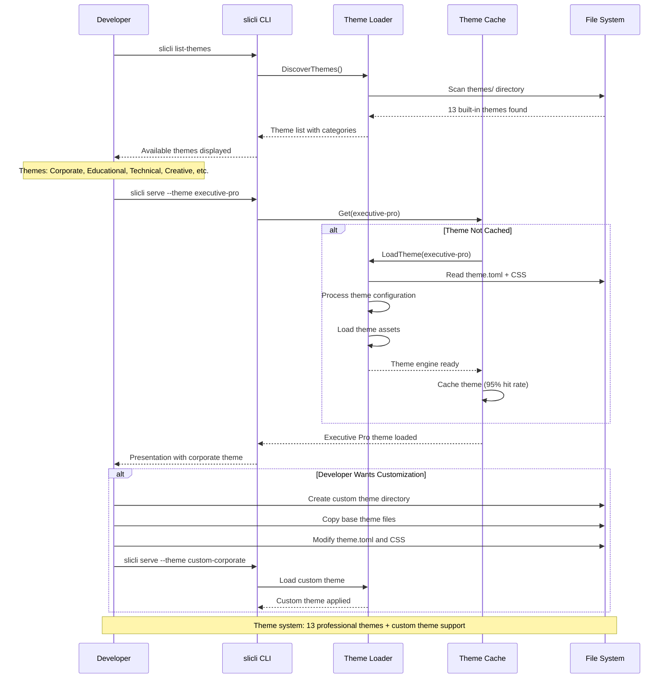
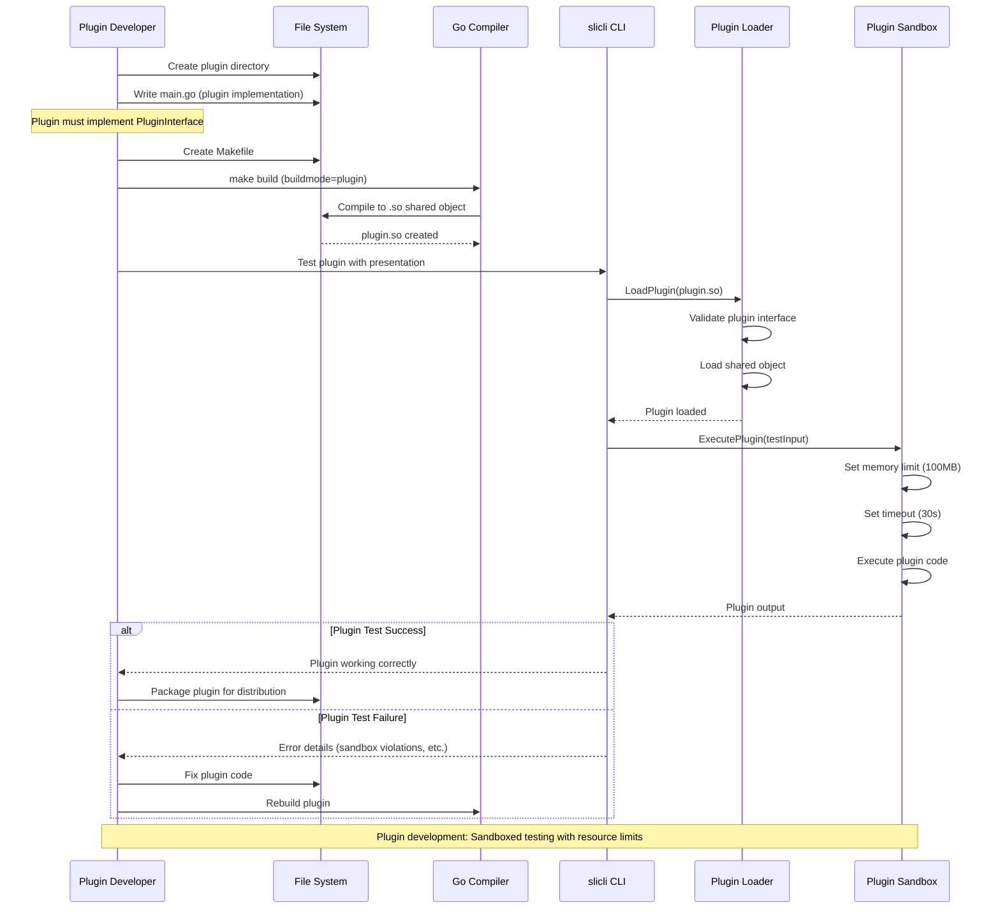
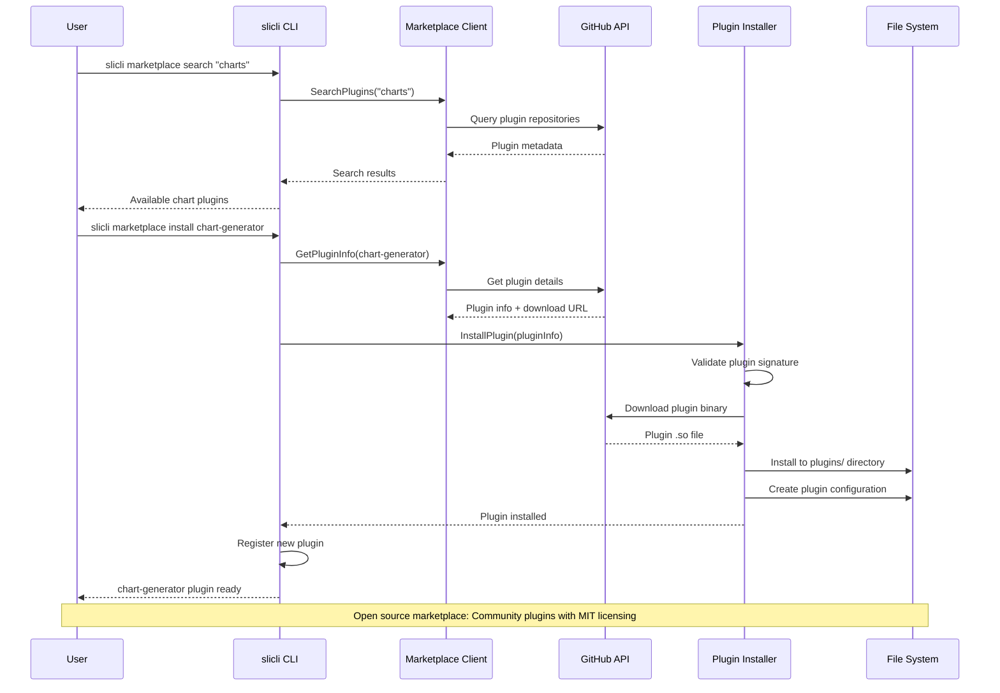
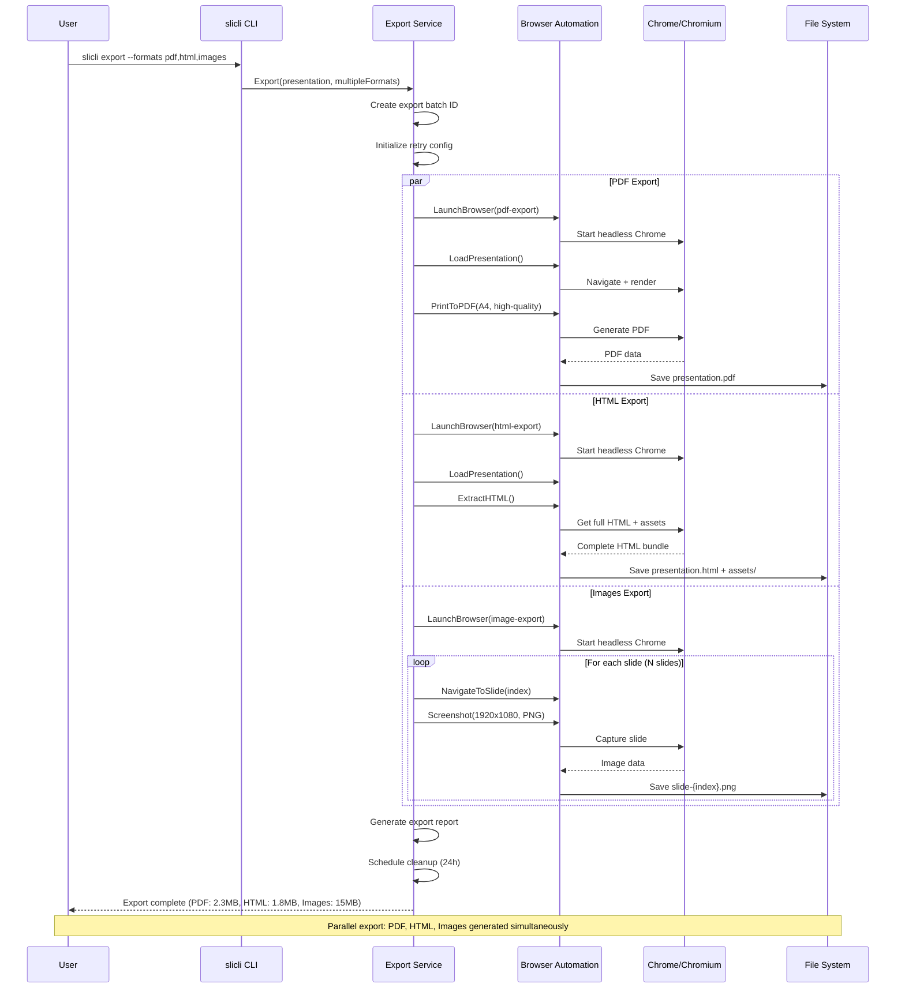
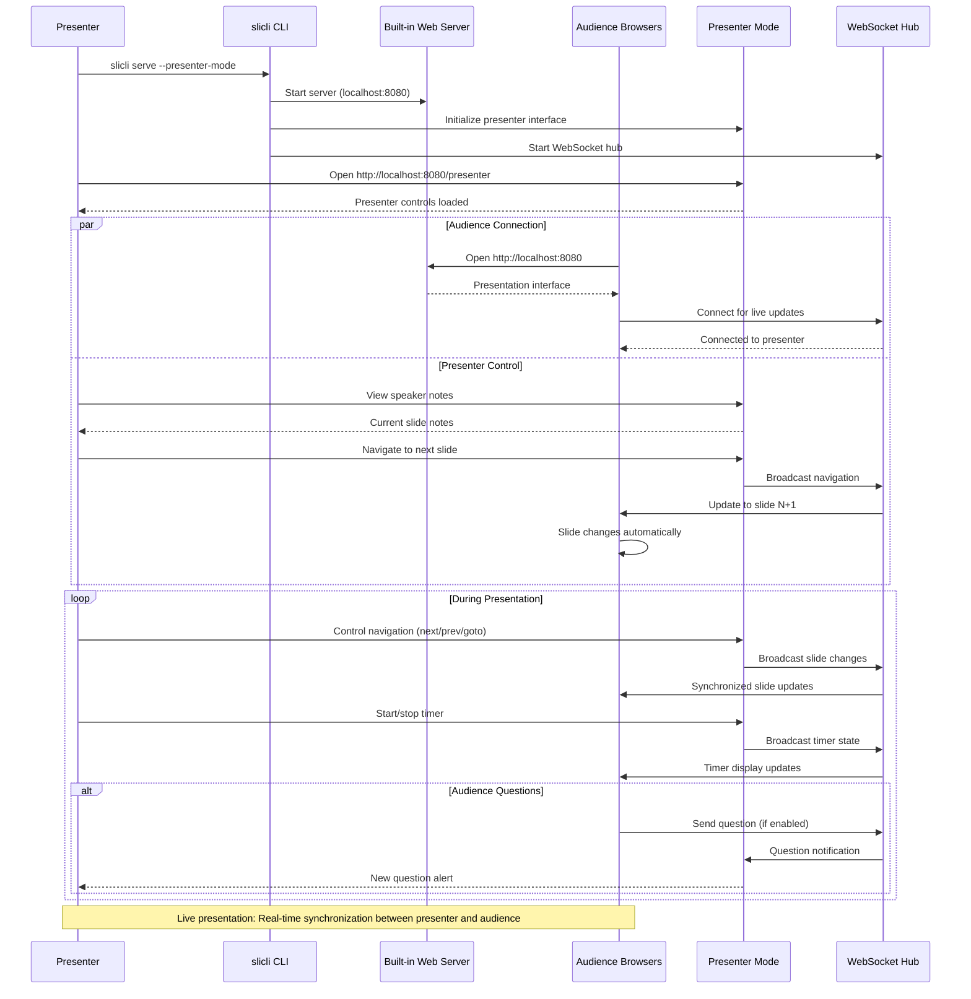
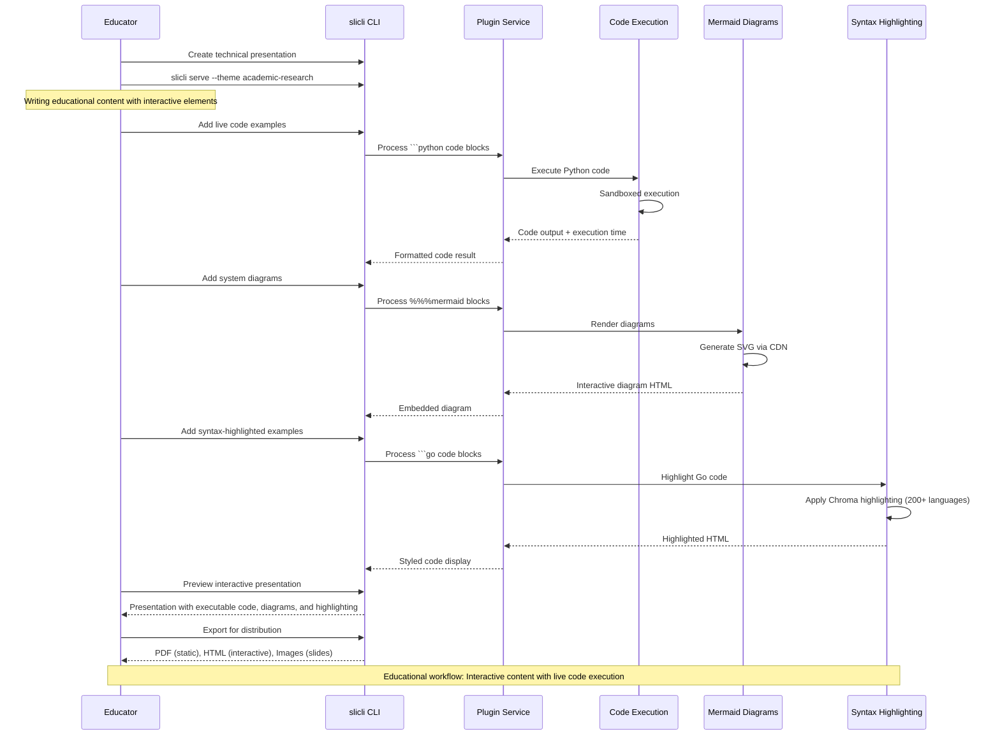
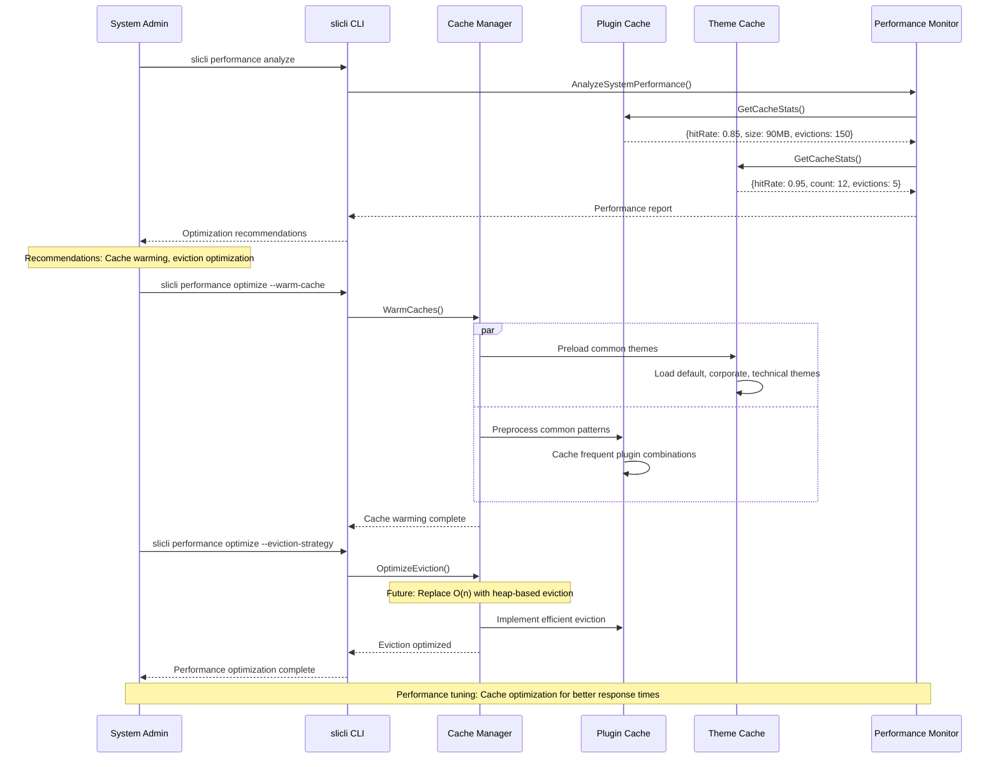

# Business Process Workflows

End-to-end business workflows for presentation development, plugin integration, and content delivery in slicli.

## Presentation Development Workflow

### Complete Development Lifecycle



### Theme Selection & Customization



## Plugin Development & Integration

### Plugin Development Workflow



### Plugin Marketplace Integration



## Export & Delivery Workflows

### Multi-Format Export Process



### Presentation Distribution Workflow



## Content Creation Workflows

### Educational Content Creation



### Corporate Presentation Workflow

```mermaid
sequenceDiagram
    participant Executive as Executive
    participant Designer as Designer
    participant slicli as slicli CLI
    participant ThemeSvc as Theme Service
    participant ExportSvc as Export Service
    participant DistributionSvc as Distribution Service
    
    Executive->>Designer: Request executive presentation
    Designer->>slicli: slicli serve --theme executive-pro
    slicli->>ThemeSvc: Load corporate theme
    ThemeSvc-->>slicli: C-suite appropriate styling
    
    Designer->>slicli: Create markdown presentation
    Designer->>slicli: Add corporate branding elements
    Designer->>slicli: Include data visualizations
    Designer->>slicli: Preview presentation
    slicli-->>Designer: Corporate-styled presentation
    
    Designer->>Executive: Share preview link
    Executive->>slicli: Review presentation
    Executive->>Designer: Request modifications
    
    loop Revision Cycle
        Designer->>slicli: Make requested changes
        slicli->>slicli: Live reload with changes
        Executive->>slicli: Review updated version
        
        alt Executive Approved
            break Revision complete
        else More Changes Needed
            Executive->>Designer: Additional feedback
        end
    end
    
    Executive->>slicli: Approve for distribution
    Designer->>ExportSvc: Export presentation (multiple formats)
    
    par
        ExportSvc->>ExportSvc: Generate PDF (for printing)
    and
        ExportSvc->>ExportSvc: Generate HTML (for web)
    and
        ExportSvc->>ExportSvc: Generate Images (for social media)
    end
    
    ExportSvc-->>DistributionSvc: Export package ready
    DistributionSvc->>DistributionSvc: Prepare distribution channels
    DistributionSvc-->>Executive: Presentation ready for delivery
    
    Note over Executive,DistributionSvc: Corporate workflow: Professional themes + multi-format distribution
```

## Performance Optimization Workflows

### Cache Warming & Optimization



## Key Business Value Metrics

**Development Velocity**:
- Live reload: ~1 second from file save to browser update
- Plugin processing: 85% cache hit rate reduces execution time
- Theme switching: 95% cache hit rate enables instant theme changes

**Content Quality**:
- Interactive code execution with sandboxed safety
- Professional themes for different business contexts
- Multi-format export for diverse distribution needs

**Collaboration Efficiency**:
- Real-time presenter mode for live presentations
- WebSocket synchronization between presenter and audience
- Version control friendly markdown source format

**Operational Excellence**:
- Browser automation for consistent export quality
- Comprehensive error handling with retry logic
- Resource monitoring and automatic cleanup

slicli enables efficient presentation development workflows while maintaining professional quality output for business, educational, and technical content.