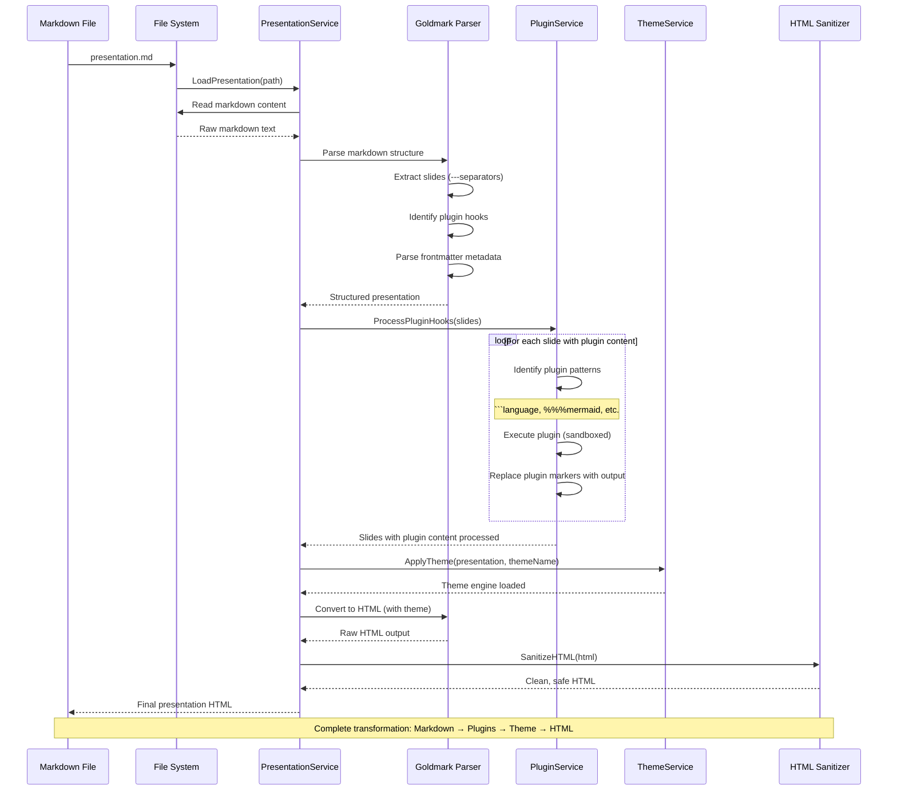
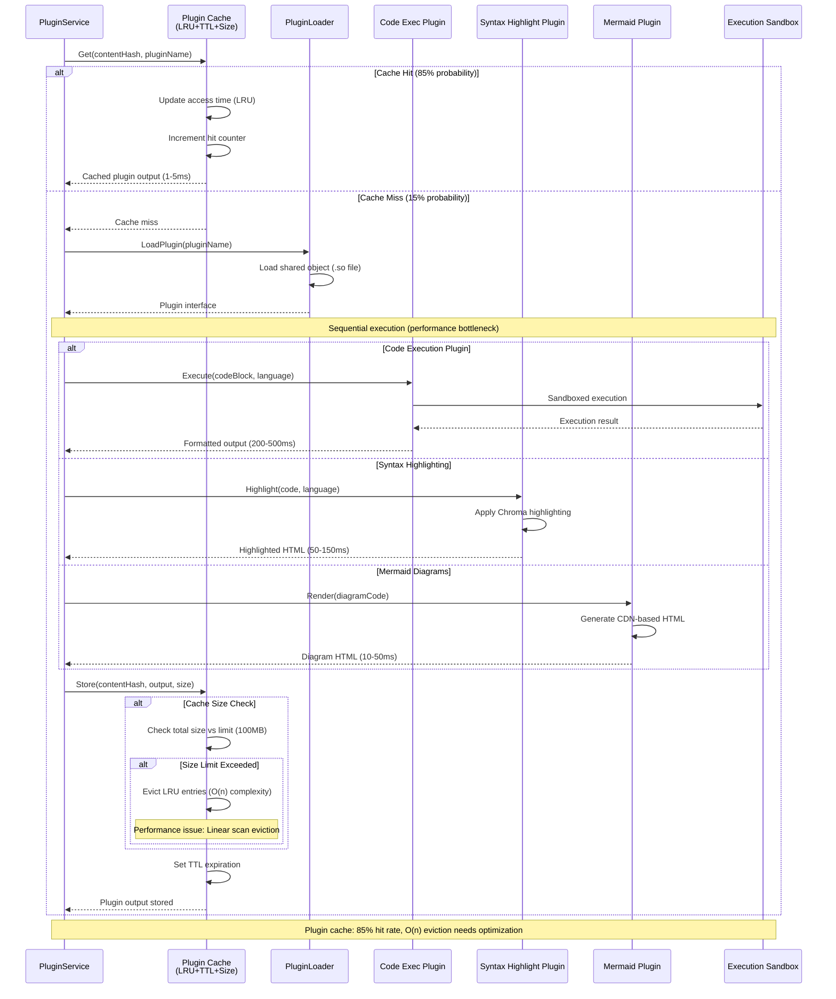
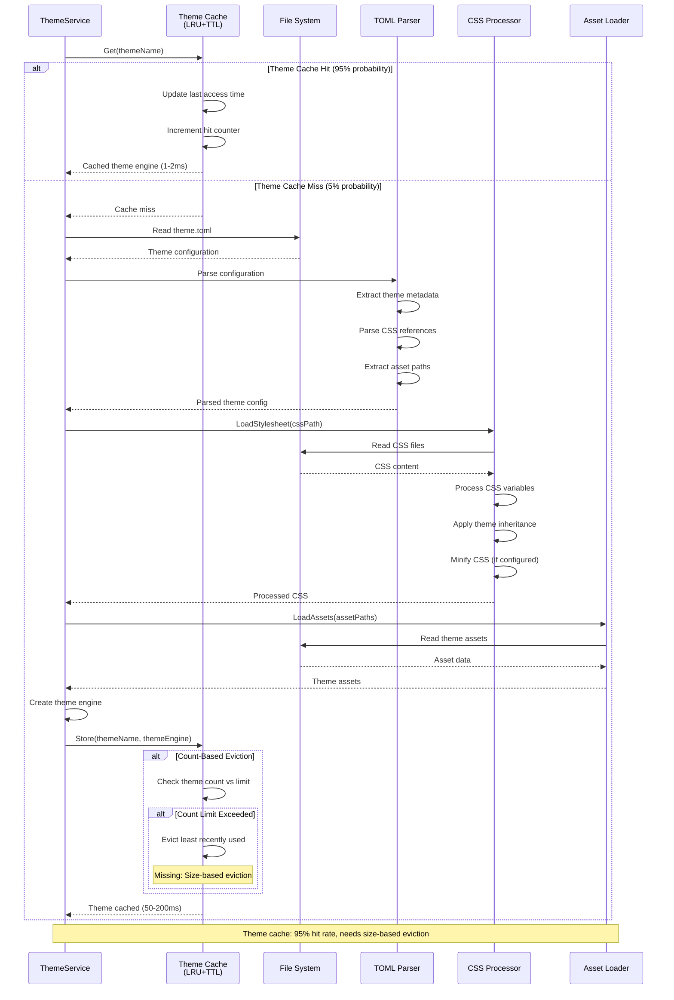
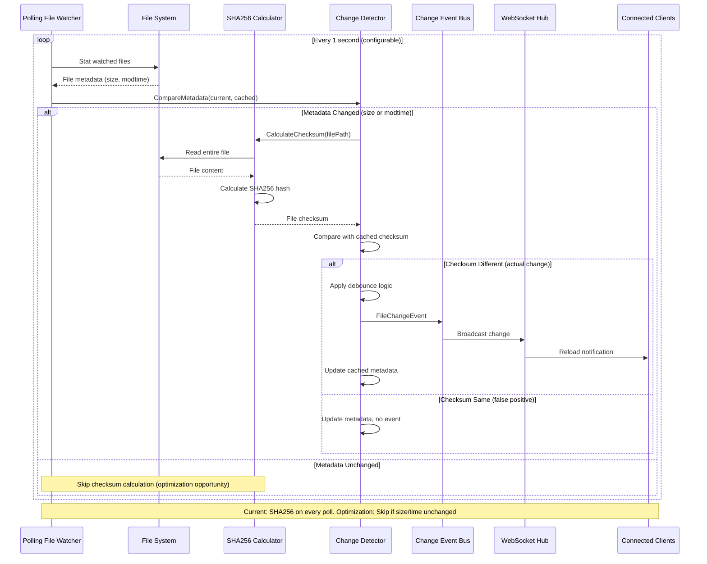
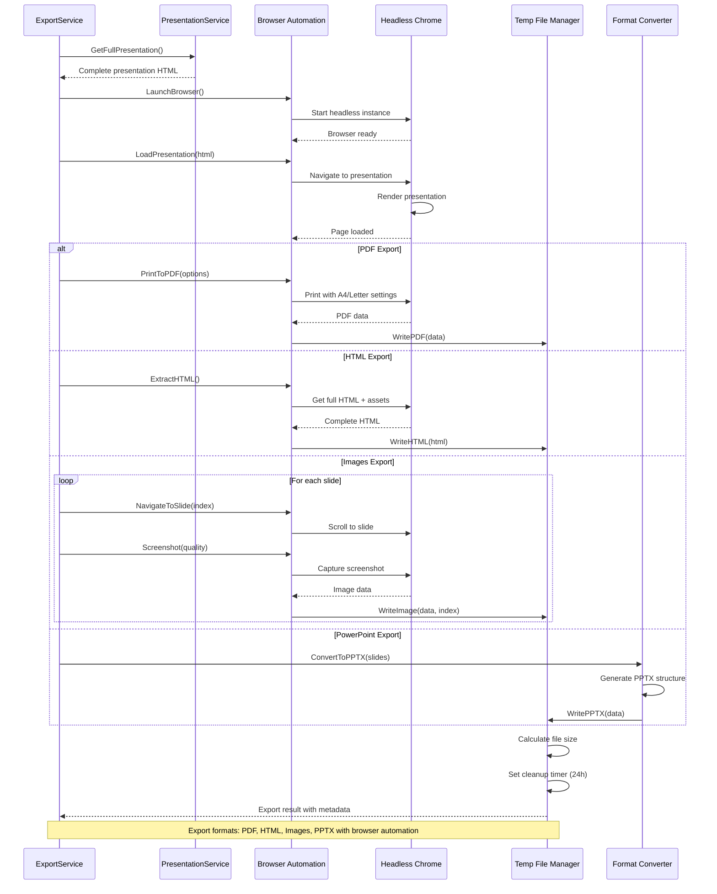
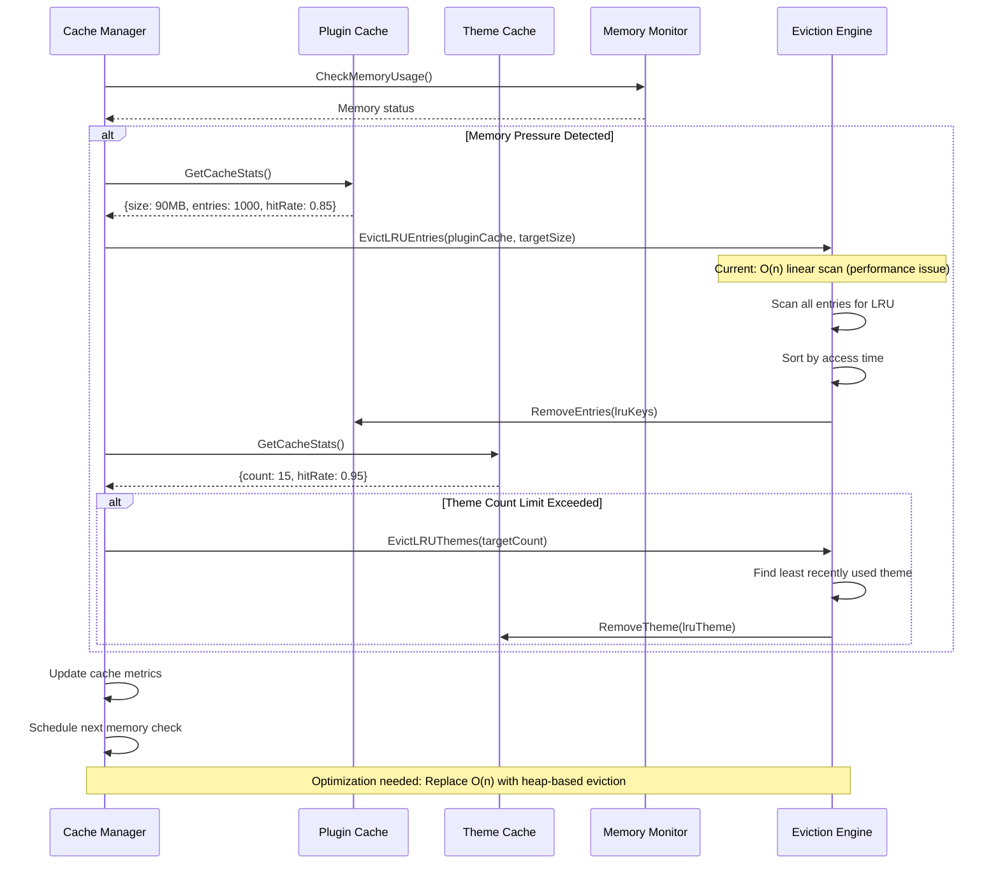
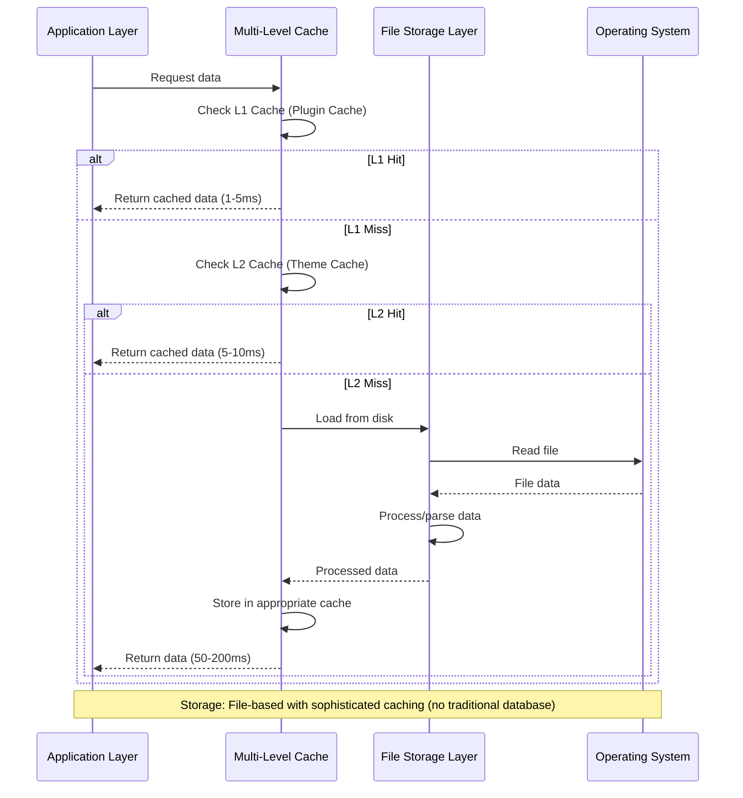

# Data Processing & Persistence Flows

Data processing sequences for markdown transformation, plugin execution, theme loading, and caching in slicli.

## Markdown Processing Pipeline

### Complete Markdown to HTML Transformation

## Plugin Execution & Caching Flow

### Plugin Processing with Multi-Level Caching

## Theme Loading & Processing

### Theme System with CSS Processing

## File System Monitoring & Change Detection

### File Watching with Checksum Validation

## Export Data Processing

### Multi-Format Export Pipeline

## Cache Performance & Memory Management

### Cache Eviction Strategies

## Database/Storage Architecture

### File-Based Storage with Caching

## Key Performance Characteristics

**Plugin Cache Performance**:
- Hit Rate: 85% (excellent)
- Eviction: O(n) complexity (optimization needed)
- Memory Limit: 100MB default
- TTL: Configurable expiration

**Theme Cache Performance**:
- Hit Rate: 95% (excellent)
- Eviction: Count-based only (needs size limits)
- Memory Usage: Uncontrolled (needs monitoring)
- TTL: Configurable expiration

**File System Monitoring**:
- Polling Frequency: 1-second intervals
- Change Detection: SHA256 checksums
- Optimization Opportunity: Skip checksum if size/modtime unchanged (95% I/O reduction)

**Processing Bottlenecks**:
- Sequential Plugin Execution: 650ms current vs 300ms potential with concurrency
- File Checksum Calculation: 100% of polls vs 5% needed
- Cache Eviction: Linear scan vs heap-based optimization

**Memory Usage**:
- Base Application: ~25MB
- Plugin Cache: Up to 100MB
- Theme Cache: ~20MB estimated
- Export Processing: Variable (10-500MB)

All data flows maintain clean architecture boundaries with domain logic isolated from infrastructure concerns.