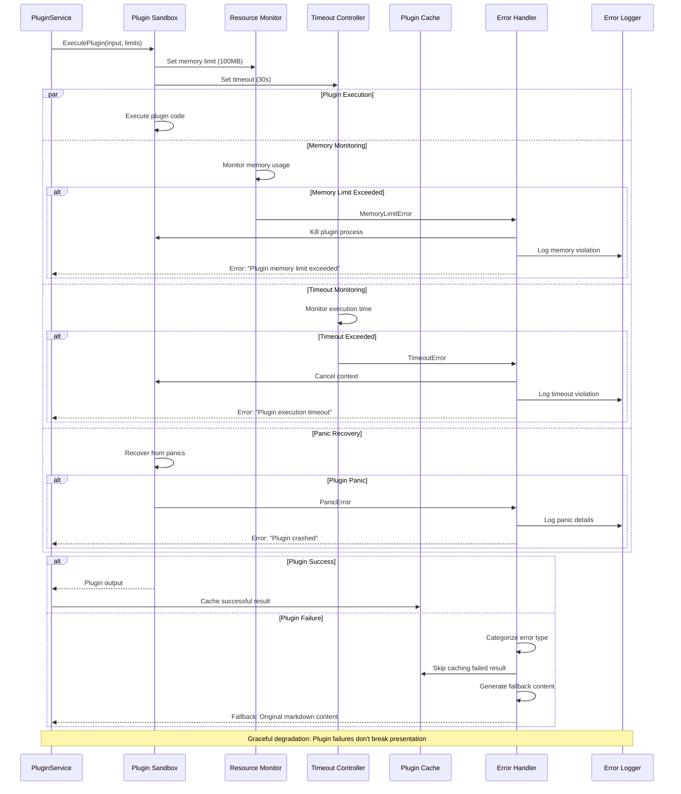
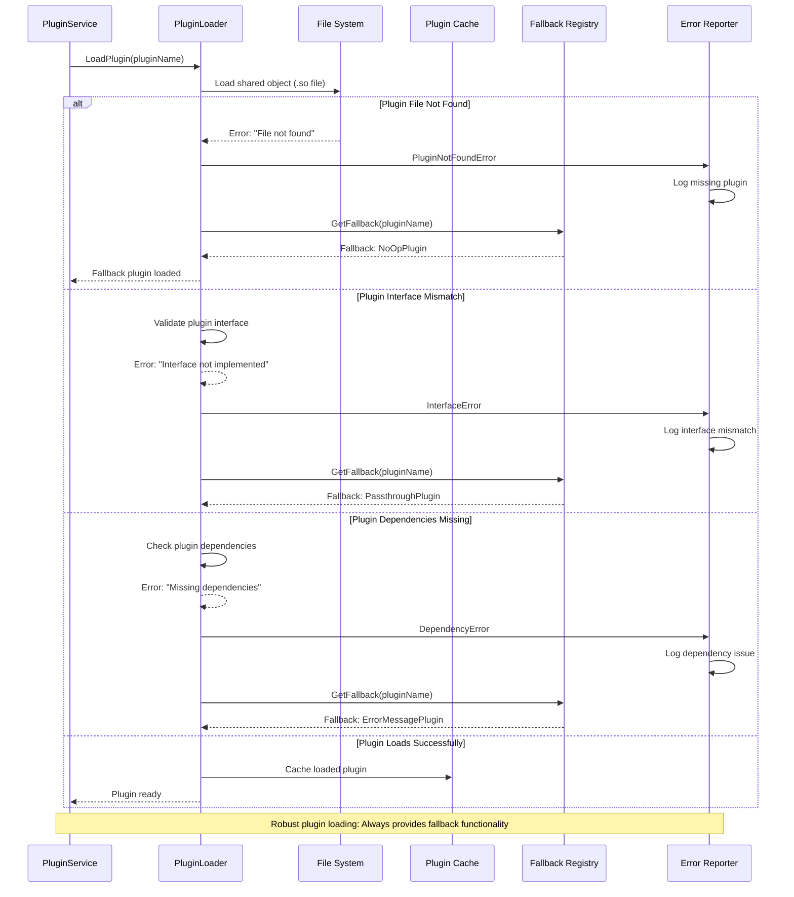
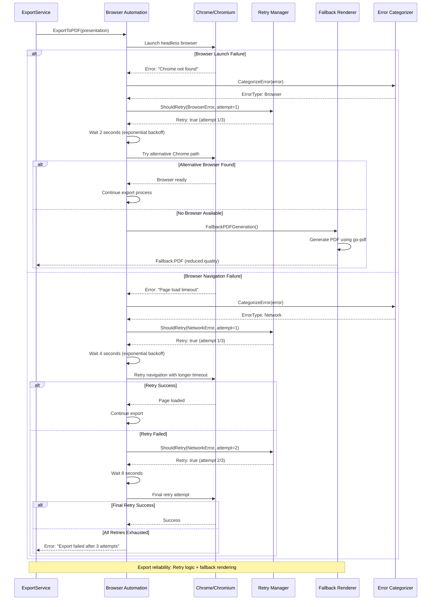
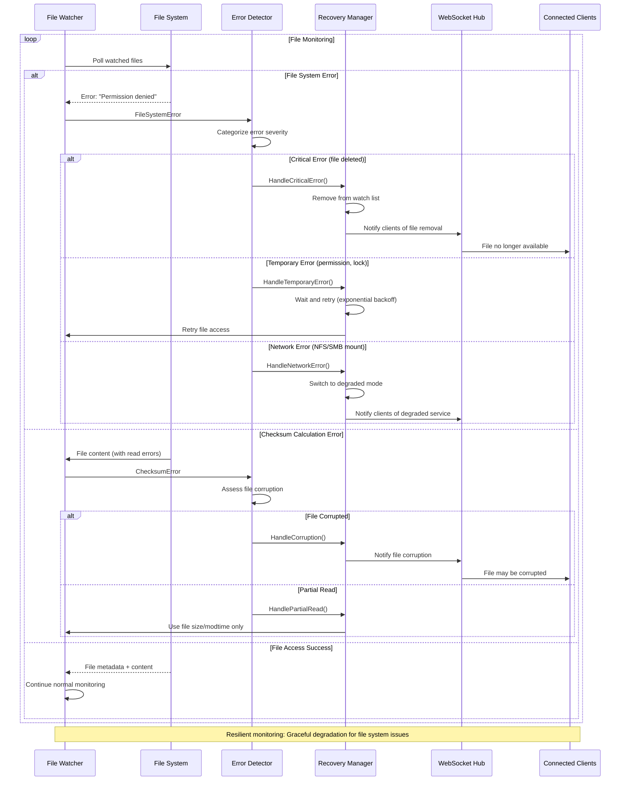
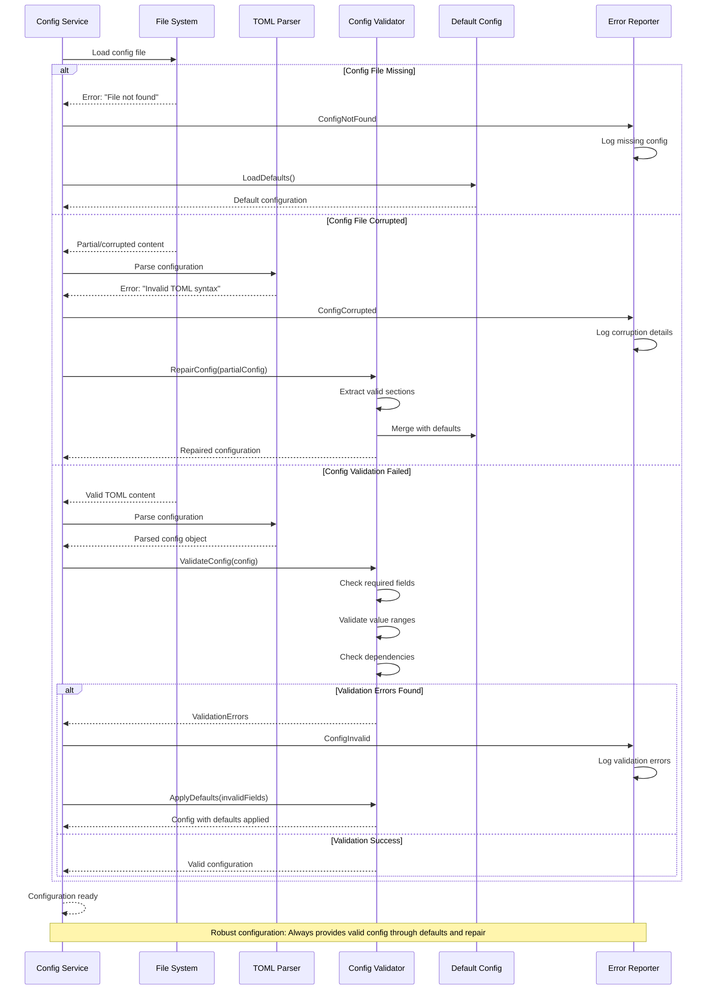
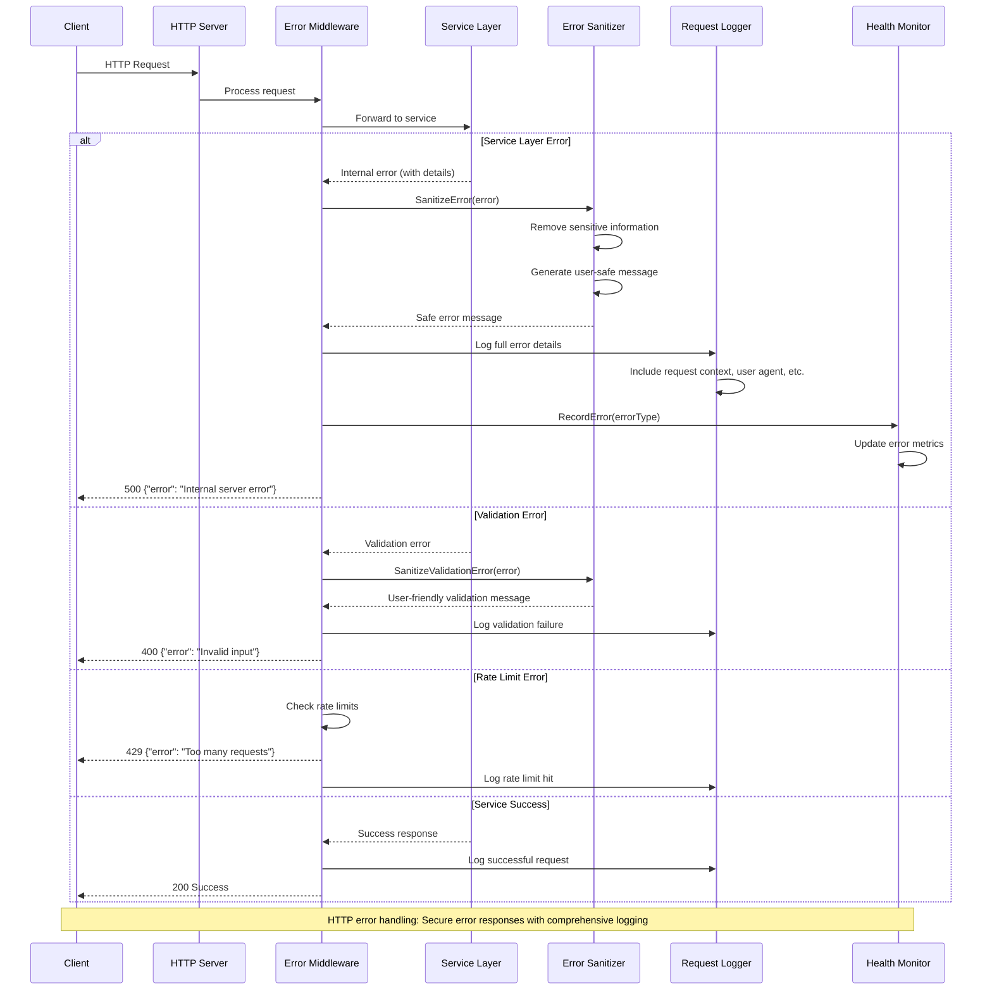
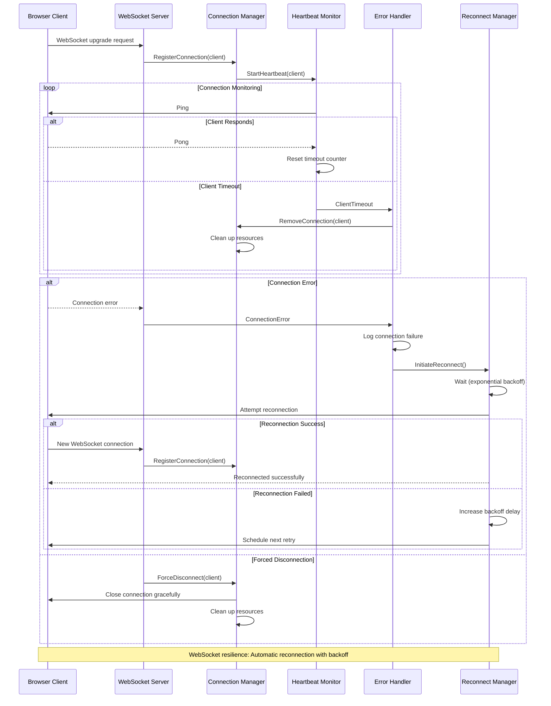
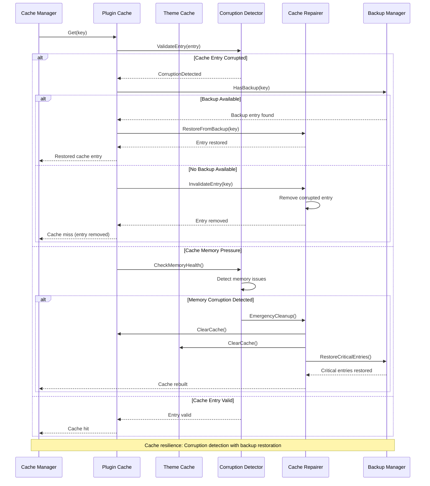

# Error Handling & Recovery Flows

Error handling sequences and recovery mechanisms for robust operation in slicli.

## Plugin Execution Error Handling

### Plugin Sandbox Failure Recovery



### Plugin Loading Error Recovery



## Export Error Handling & Retry Logic

### Browser Automation Failure Recovery



### Export Format Fallback Strategy

```mermaid
sequenceDiagram
    participant User as User
    participant ExportSvc as ExportService
    participant PDFRenderer as PDF Renderer
    parameter HTMLRenderer as HTML Renderer
    participant ImageRenderer as Image Renderer
    participant FallbackChain as Fallback Chain
    participant ErrorAggregator as Error Aggregator
    
    User->>ExportSvc: Export presentation (PDF, HTML, Images)
    
    par PDF Export
        ExportSvc->>PDFRenderer: GeneratePDF()
        PDFRenderer->>PDFRenderer: Browser automation PDF
        alt PDF Generation Failed
            PDFRenderer-->>ExportSvc: Error: "PDF generation failed"
            ExportSvc->>FallbackChain: GetPDFFallback()
            FallbackChain->>FallbackChain: Use HTML → PDF conversion
            FallbackChain-->>ExportSvc: Fallback PDF generated
        else PDF Success
            PDFRenderer-->>ExportSvc: PDF ready
        end
    and HTML Export
        ExportSvc->>HTMLRenderer: GenerateHTML()
        HTMLRenderer->>HTMLRenderer: Extract full HTML + assets
        alt HTML Generation Failed
            HTMLRenderer-->>ExportSvc: Error: "HTML extraction failed"
            ExportSvc->>FallbackChain: GetHTMLFallback()
            FallbackChain->>FallbackChain: Use static HTML template
            FallbackChain-->>ExportSvc: Basic HTML generated
        else HTML Success
            HTMLRenderer-->>ExportSvc: HTML bundle ready
        end
    and Images Export
        ExportSvc->>ImageRenderer: GenerateImages()
        ImageRenderer->>ImageRenderer: Screenshot each slide
        alt Image Generation Failed
            ImageRenderer-->>ExportSvc: Error: "Screenshot failed"
            ExportSvc->>FallbackChain: GetImageFallback()
            FallbackChain->>FallbackChain: Use HTML canvas rendering
            FallbackChain-->>ExportSvc: Canvas-based images
        else Images Success
            ImageRenderer-->>ExportSvc: All slide images ready
        end
    end
    
    ExportSvc->>ErrorAggregator: CollectExportResults()
    ErrorAggregator->>ErrorAggregator: Aggregate success/failure status
    ErrorAggregator-->>ExportSvc: Export summary
    
    ExportSvc-->>User: Export complete (with fallback details if any)
    
    Note over User,ErrorAggregator: Comprehensive fallback: Ensures some export format always succeeds
```

## File System Error Handling

### File Watching Error Recovery



### Configuration Loading Error Handling



## Network & Connectivity Error Handling

### HTTP Server Error Recovery



### WebSocket Connection Error Handling



## Cache Error Handling

### Cache Corruption Recovery



## Key Error Handling Principles

**Graceful Degradation**:
- Plugin failures don't break presentations (fallback to original content)
- Export failures provide alternative formats
- File system issues trigger degraded monitoring mode

**Comprehensive Retry Logic**:
- Exponential backoff for network and browser errors
- Maximum retry attempts (typically 3) with increasing delays
- Error categorization to determine retry eligibility

**Fallback Strategies**:
- Alternative renderers when browser automation fails
- Default configurations when config files are missing/corrupt
- Passthrough plugins when specific plugins can't load

**Security-Focused Error Handling**:
- Error sanitization prevents information disclosure
- Full error details logged for debugging
- Rate limiting to prevent abuse

**Resource Protection**:
- Memory limits and timeouts for plugin execution
- Connection limits and heartbeat monitoring for WebSocket
- Cache corruption detection with automatic cleanup

**User Experience**:
- Non-blocking error recovery where possible
- Clear error messages without technical details
- Automatic reconnection for network issues

slicli's error handling ensures robust operation even when individual components fail, maintaining presentation generation capability through comprehensive fallback mechanisms.