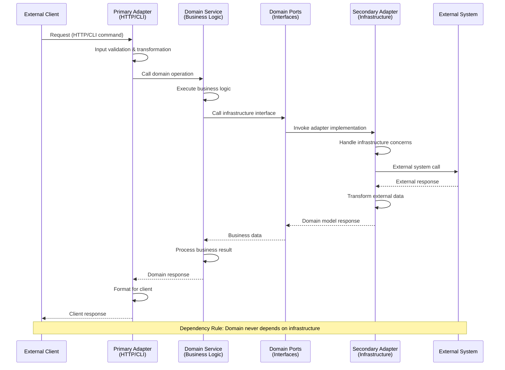
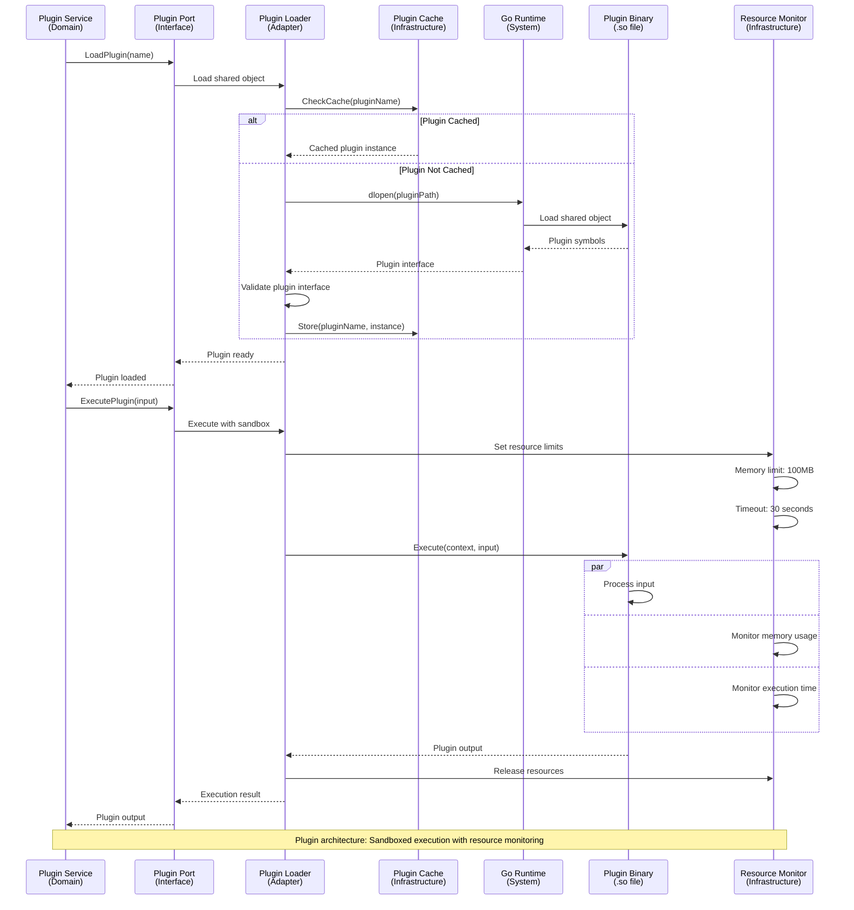
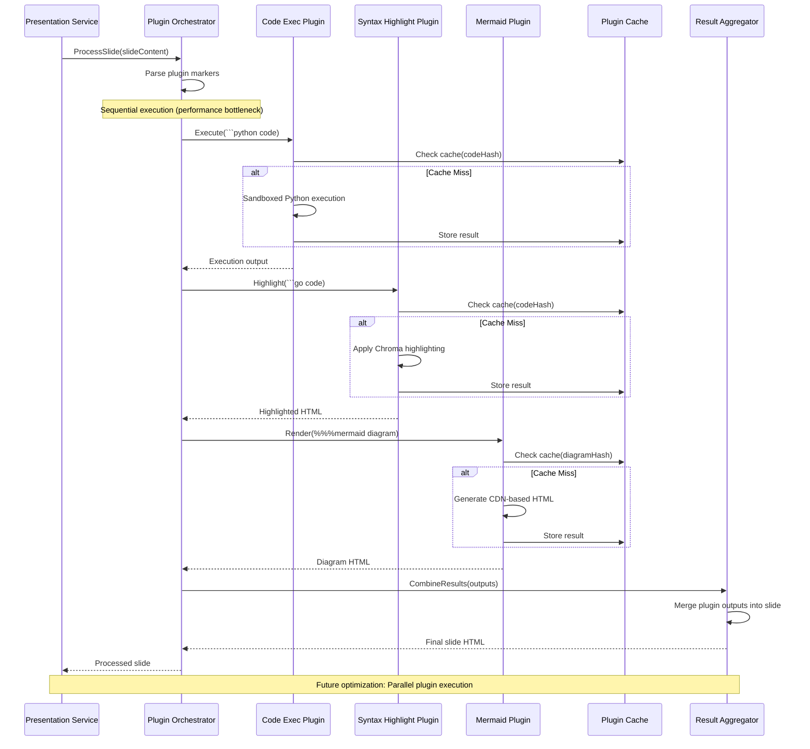
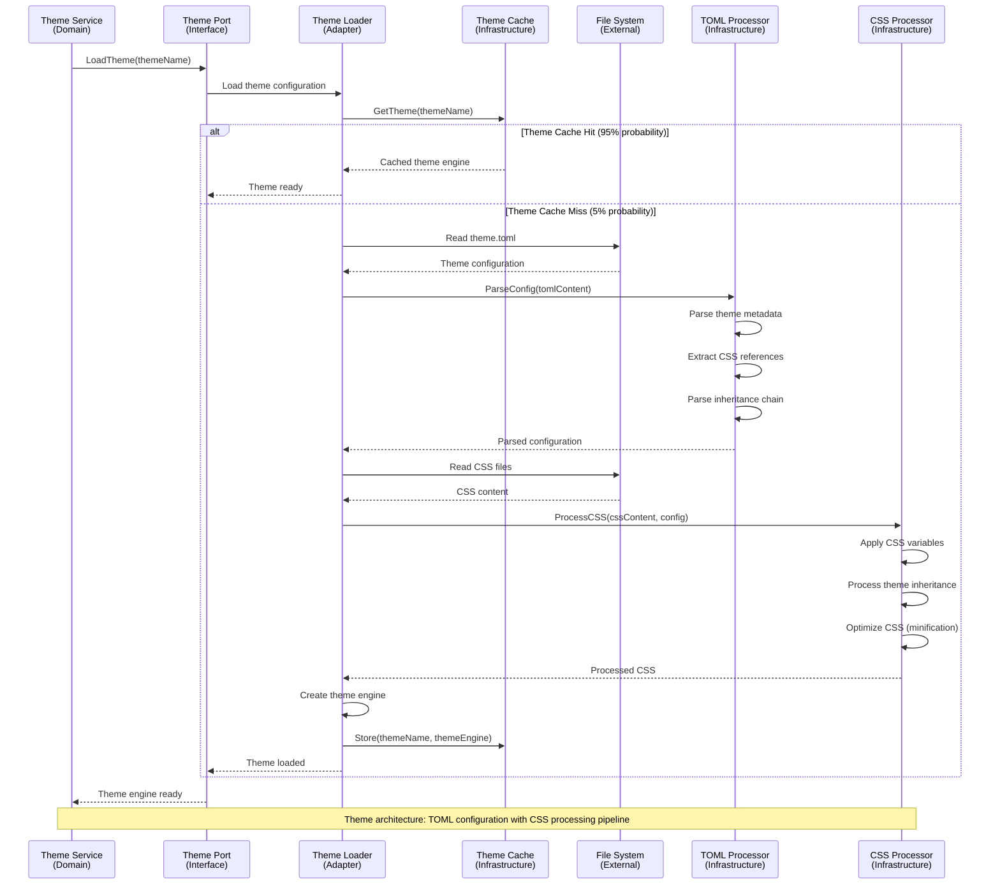
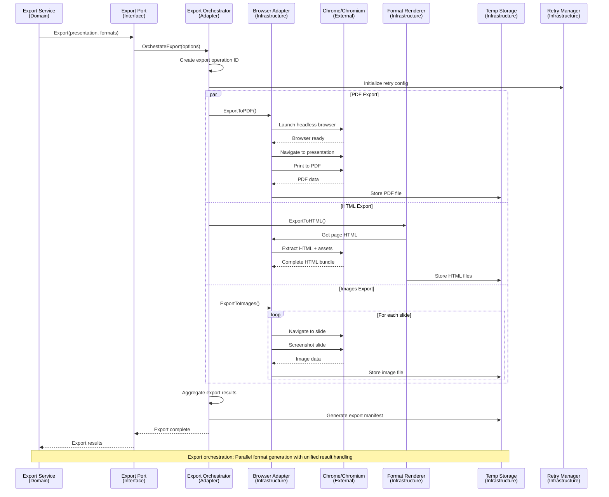
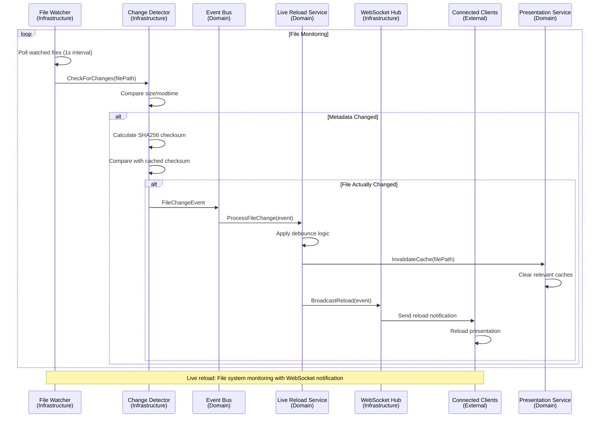
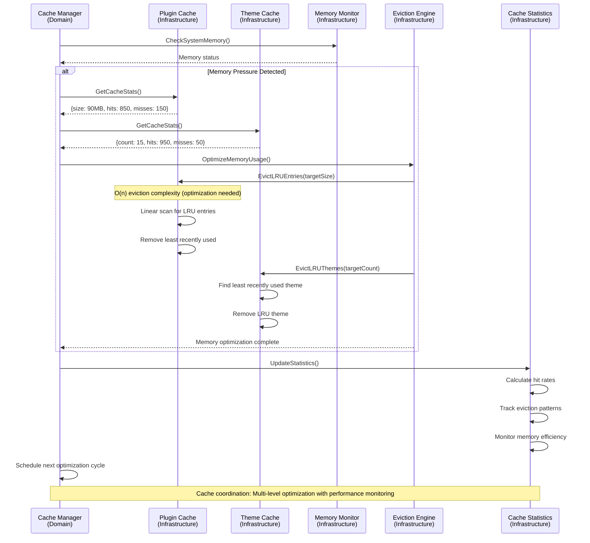
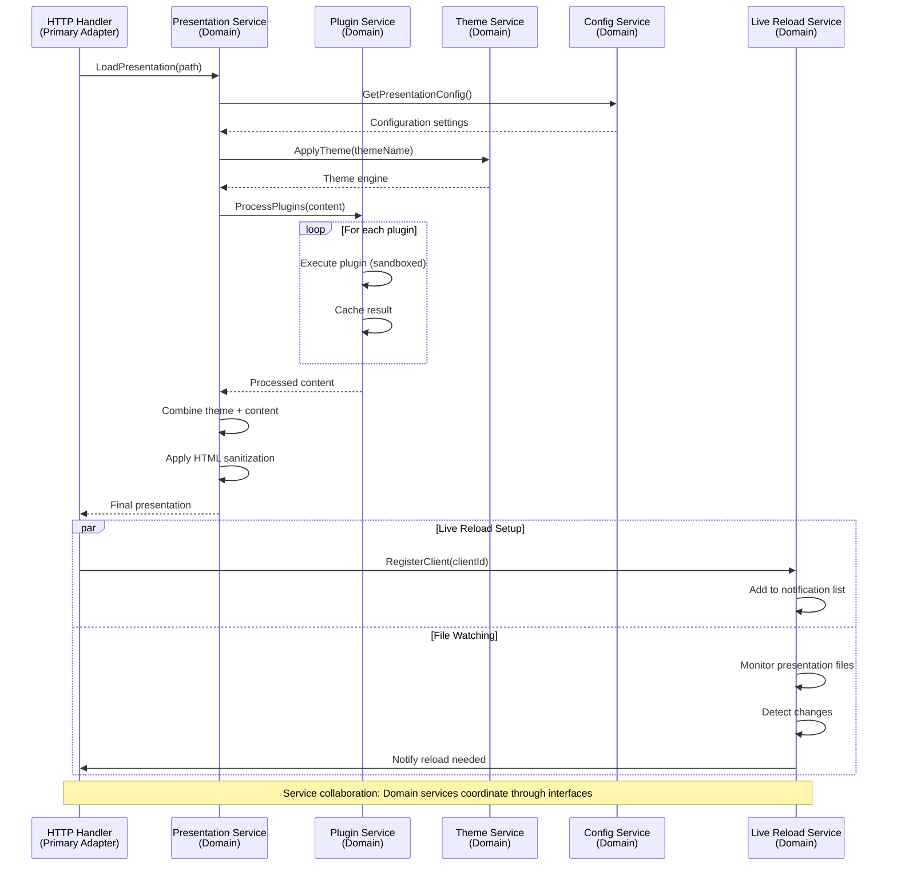
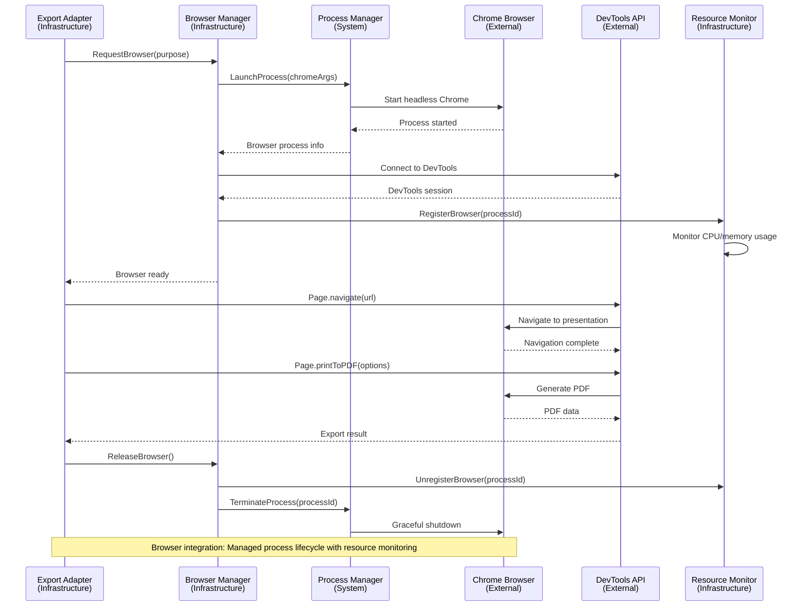

# System Interaction Flows

Service-to-service communication patterns and clean architecture layer interactions in slicli.

## Clean Architecture Layer Communication

### Hexagonal Architecture Flow

## Plugin System Architecture

### Plugin Loading & Execution Architecture

### Plugin Communication Patterns

## Theme System Architecture

### Theme Loading & Processing Flow

## Export System Architecture

### Multi-Format Export Orchestration

## File System Monitoring Architecture

### Live Reload System Integration

## Cache System Architecture

### Multi-Level Cache Coordination

## Service Communication Patterns

### Domain Service Interactions

## External System Integration

### Browser Automation Integration

## Performance Optimization Opportunities

**Sequential Plugin Execution**:
- Current: Plugins execute one after another (650ms total)
- Optimization: Parallel execution where possible (300ms potential)
- Challenge: Dependency management between plugins

**Cache Eviction Complexity**:
- Current: O(n) linear scan for LRU eviction
- Optimization: Heap-based priority queue (O(log n))
- Impact: 90% faster eviction for large caches

**File System Monitoring**:
- Current: SHA256 checksum on every poll
- Optimization: Skip checksum if size/modtime unchanged
- Impact: 95% reduction in unnecessary I/O

**WebSocket Connection Management**:
- Current: Per-connection heartbeat monitoring
- Optimization: Batch heartbeat processing
- Impact: Reduced CPU overhead for many connections

## Architecture Quality Characteristics

**Dependency Inversion**: Domain layer never depends on infrastructure
**Interface Segregation**: Focused, single-purpose port interfaces
**Single Responsibility**: Each service handles one business concern
**Open/Closed**: Plugin system allows extension without modification
**Separation of Concerns**: Clear boundaries between layers
**Testability**: Interfaces enable comprehensive mocking for tests

slicli's system interactions demonstrate excellent clean architecture implementation with clear separation between business logic and infrastructure concerns.