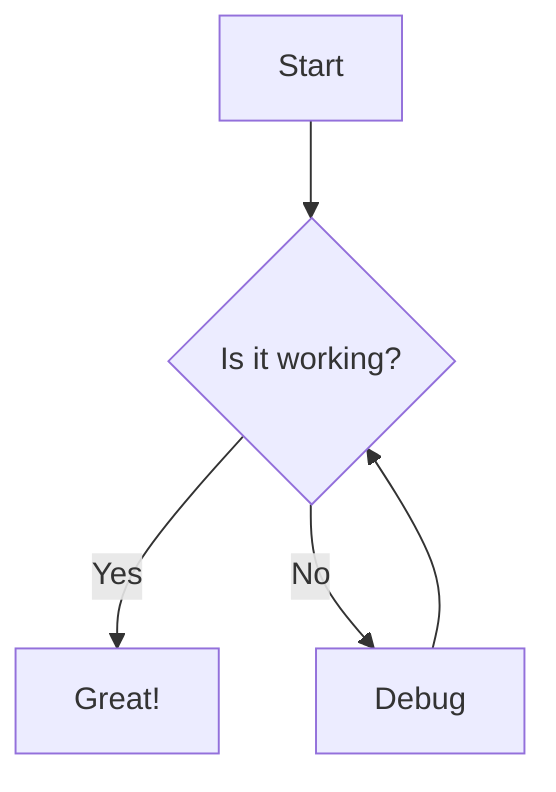

# Welcome to SLICLI

A modern presentation framework for developers

---

## What is SLICLI?

- 🚀 **Fast** - Built with Go for performance
- 📝 **Markdown-based** - Write slides in familiar Markdown
- 🎨 **Themeable** - Beautiful built-in themes
- 🔌 **Extensible** - Plugin system for custom functionality
- 🔄 **Live Reload** - See changes instantly

---

## Features Showcase

### Code Execution
```go
package main

import "fmt"

func main() {
    fmt.Println("Hello from SLICLI!")
}
```

### Mermaid Diagrams


---

## Architecture

```mermaid
architecture-beta
    group api(cloud)[API Layer]
    group logic(cloud)[Business Logic]
    group data(cloud)[Data Layer]
    
    service web(internet)[Web Server] in api
    service auth(shield)[Auth Service] in api
    service core(server)[Core Engine] in logic
    service plugin(puzzle)[Plugin System] in logic
    service db(database)[Database] in data
    service cache(disk)[Cache] in data
    
    web:R --> L:auth
    auth:B --> T:core
    core:R --> L:plugin
    core:B --> T:db
    plugin:B --> T:cache
```



---

## Live Demonstration

This presentation is running on **SLICLI** right now!

- Navigate with arrow keys ← →
- Press `F` for fullscreen
- Press `Esc` to exit fullscreen
- Changes to this file will automatically reload

---

## Getting Started

1. **Install SLICLI**
   ```bash
   go install github.com/fredcamaral/slicli
   ```

2. **Create your presentation**
   ```bash
   echo "# My Presentation" > slides.md
   ```

3. **Start presenting**
   ```bash
   slicli serve slides.md
   ```

---

## Plugin System Demo

### Bash Execution
```bash
echo "Hello from Bash!"
date
ls -la | head -5
```

### Python Code
```python
import datetime

def greet(name):
    now = datetime.datetime.now()
    return f"Hello {name}! Current time: {now.strftime('%H:%M:%S')}"

print(greet("SLICLI User"))
print("Python is working perfectly!")
```

### JavaScript Demo
```javascript
function factorial(n) {
    return n <= 1 ? 1 : n * factorial(n - 1);
}

console.log("Factorial of 5:", factorial(5));
console.log("JavaScript execution successful!");
```

---

## Thank You!

### Questions?

- 📧 Email: your-email@example.com
- 🐙 GitHub: github.com/fredcamaral/slicli
- 💬 Discussion: Open an issue for questions

**Happy Presenting! 🎉**